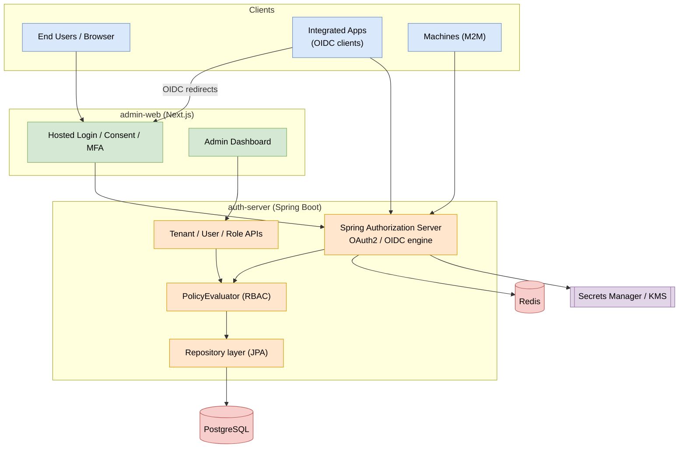
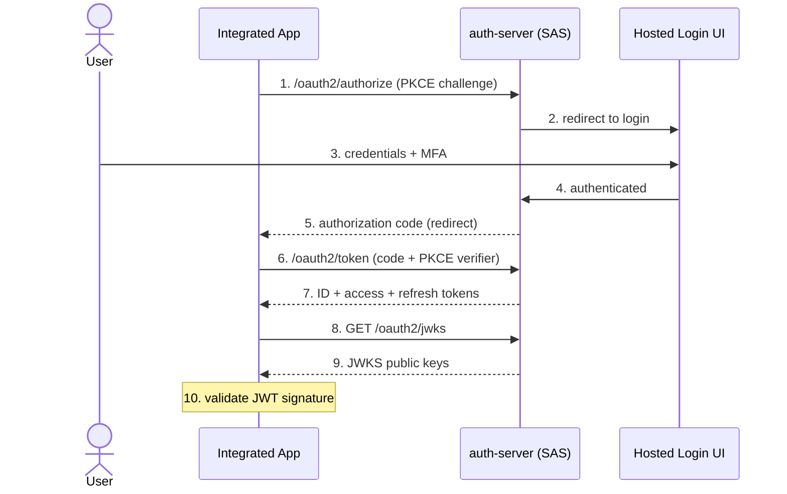
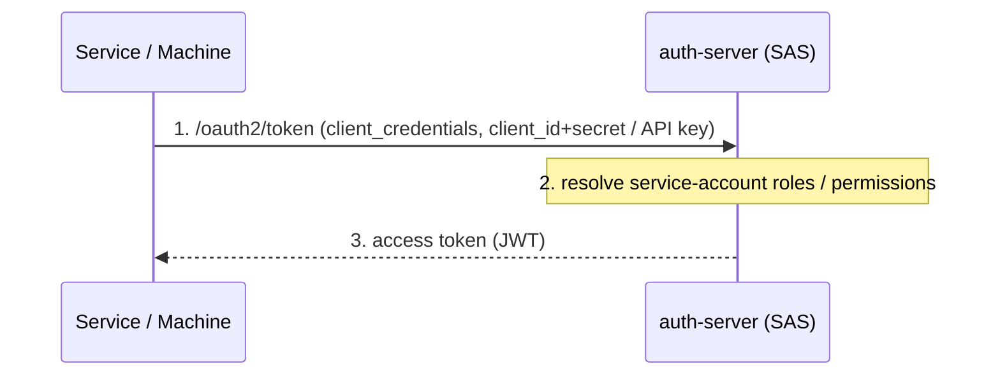
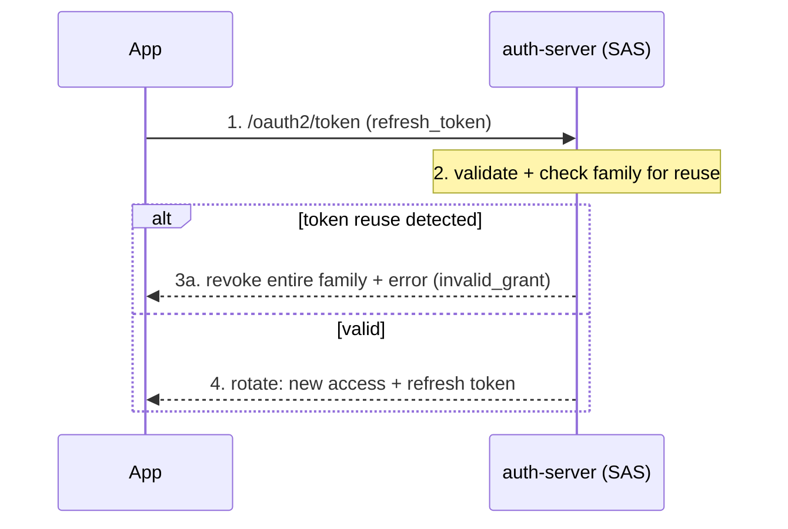
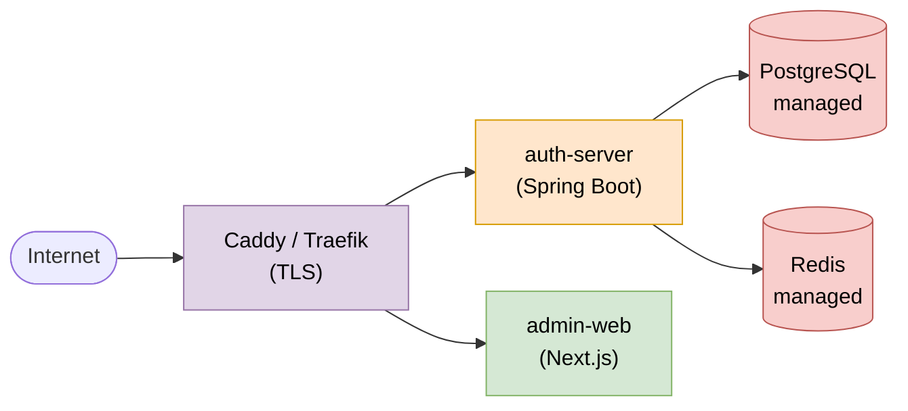
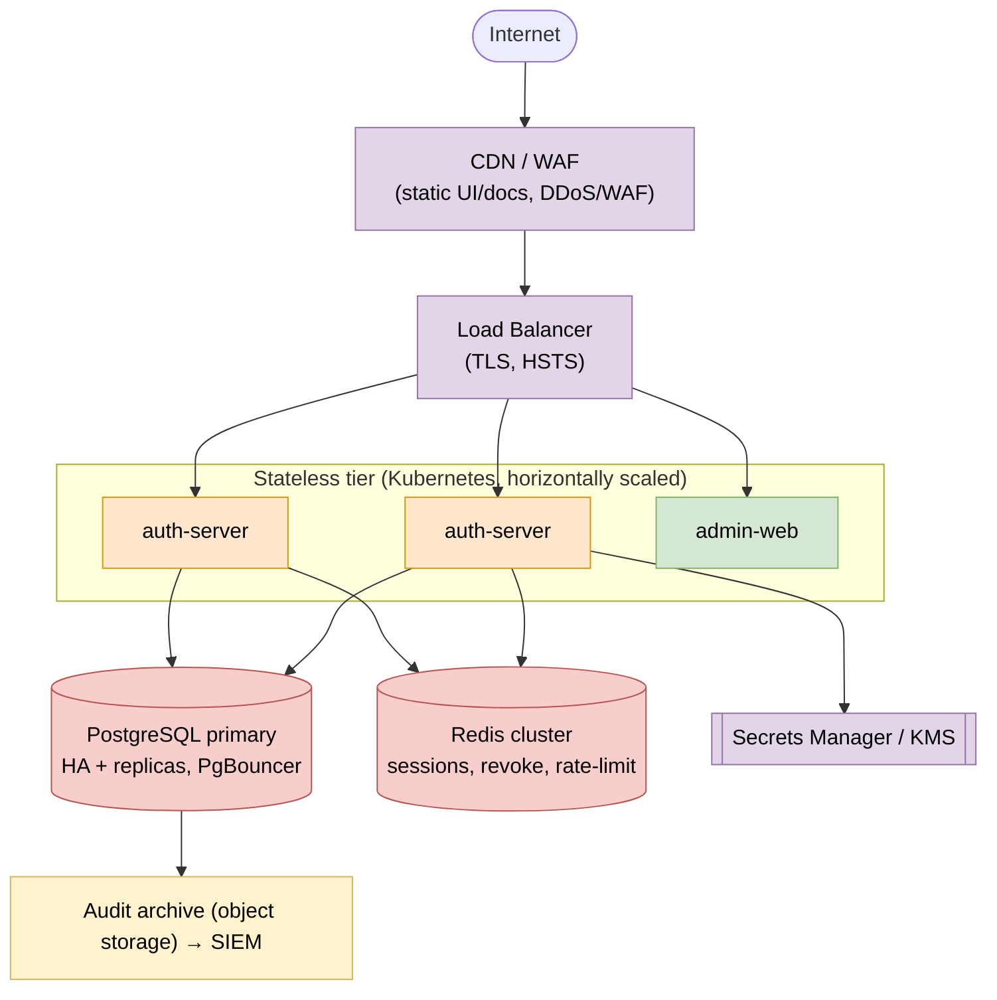

# 03 — Architecture

## System components

| Component | Tech | Responsibility |
|---|---|---|
| **auth-server** | Spring Boot + Spring Authorization Server | OIDC/OAuth endpoints, token issuance, JWKS, user/tenant/role APIs, admin APIs |
| **admin-web** | Next.js | Admin dashboard + hosted login/consent/MFA pages |
| **docs-site** | Next.js/Nextra + Scalar | Public developer docs + OpenAPI rendering |
| **sdk-js** | TypeScript | Client SDK for integrating applications |
| **PostgreSQL** | RDBMS | Durable system of record |
| **Redis** | Cache | Sessions, refresh-token store + revocation, rate limiting, MFA challenges |
| **Secrets manager** | KMS / Vault | Signing keys, TOTP seed encryption keys, client secrets |

The `auth-server` is **stateless** (no in-memory session state) so it scales horizontally; all shared state lives in Redis and the database.

## Logical architecture

> Editable source: [`diagrams/logical-architecture.drawio`](diagrams/logical-architecture.drawio)

## Core request flows

### Authorization Code + PKCE (web / SPA / mobile login)

> Editable source: [`diagrams/auth-flow-authorization-code-pkce.drawio`](diagrams/auth-flow-authorization-code-pkce.drawio)

### Client Credentials (machine-to-machine)

> Editable source: [`diagrams/auth-flow-client-credentials.drawio`](diagrams/auth-flow-client-credentials.drawio)

### Refresh with rotation

> Editable source: [`diagrams/auth-flow-refresh-rotation.drawio`](diagrams/auth-flow-refresh-rotation.drawio)

Full standards detail: [Auth Standards](05-auth-standards.md).

## Multi-tenancy & isolation

With PostgreSQL committed, isolation is enforced in **layers (defense in depth)**:

1. **Mandatory `tenant_id`** on every tenant-scoped table.
2. **Hibernate `@Filter`** auto-enabled per request from the authenticated principal's tenant, so no query can omit the predicate.
3. **PostgreSQL Row-Level Security (RLS)** policies keyed on a per-connection `app.tenant_id` setting — a database-enforced backstop even if app code has a bug.
4. **Automated cross-tenant isolation tests** in CI (read tenant B as tenant A → must fail).

Tenant resolution strategy is pluggable to allow, later, schema-per-tenant or database-per-tenant for enterprise customers. MVP uses **shared database, shared schema, `tenant_id` discriminator** + RLS. See the layered diagram in [Database Strategy](06-database.md#tenant-isolation-defense-in-depth) ([editable source](diagrams/tenant-isolation.drawio)).

## Trust tiers

| Tier | Stored as | Scope |
|---|---|---|
| Platform admin (super-admin) | separate `platform_admin` table | All tenants; manages the deployment |
| Tenant admin | `user_account.type = ADMIN` | One tenant |
| End user | `user_account.type = USER` | One tenant, per-app roles |
| Service account | `service_account` | M2M within a tenant |

Platform admins are deliberately decoupled from any tenant so a tenant-scoped bug cannot escalate to platform control.

## Deployment topology

### MVP (cheap, fast)
- Docker containers via **Docker Compose** or a PaaS (Render / Fly.io / Railway).
- Managed PostgreSQL + managed Redis.
- **Caddy / Traefik** for TLS termination + reverse proxy.

> Editable source: [`diagrams/deployment-mvp.drawio`](diagrams/deployment-mvp.drawio)

### Production (scale)

> Editable source: [`diagrams/deployment-production.drawio`](diagrams/deployment-production.drawio)

- **Kubernetes + Helm** when Compose is outgrown; the Helm chart doubles as the self-host distribution.
- DB connection pooling (e.g. **PgBouncer** for Postgres) and read replicas for read-heavy admin/audit queries.
- Aggressively cache JWKS, discovery docs, and tenant config.
- Signing keys/secrets always in a KMS/Vault in production — never env files.

See [Security](07-security.md) for hardening and [Installation](09-installation.md) for setup.
