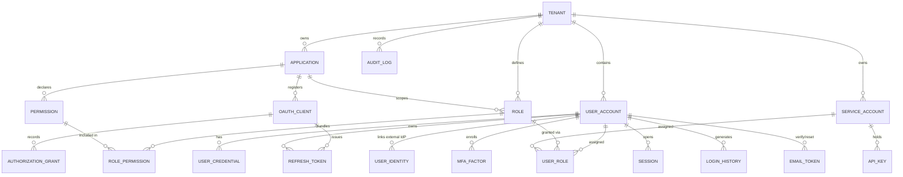

# 04 — Data Model

The schema targets **PostgreSQL** via JPA/Hibernate + Flyway, and is **Spring Authorization Server compatible**. Types stay mostly engine-neutral (via the conventions below) so the data layer can be ported to another engine later with limited churn, but Postgres features (`jsonb`, RLS) are used where they add real value.

## Conventions

| Concern | Decision | Why |
|---|---|---|
| Primary keys | **UUID v7**, `uuid` column, `@JdbcTypeCode(SqlTypes.UUID)` | Time-ordered, no sequence contention, non-guessable |
| Enums | `VARCHAR` + `@Enumerated(STRING)` | Avoid native DB enums (rigid, hard to migrate, non-portable) |
| JSON | `@JdbcTypeCode(SqlTypes.JSON)` → `jsonb` | Indexable, queryable metadata |
| Timestamps | UTC always; `timestamptz` | Prevent TZ drift |
| Booleans | `BOOLEAN` | Native in Postgres |
| Email | stored lowercased | Consistent uniqueness/lookups |
| Tenant isolation | `tenant_id` on every tenant-scoped table + **RLS** policies | DB-enforced backstop (see [Database Strategy](06-database.md)) |
| Migrations | Flyway, `db/migration/postgresql` | Versioned, repeatable |

## ERD

---

## Domain 1 — Tenancy & Applications

### `tenant`
| Column | Type | Notes |
|---|---|---|
| id | UUID | PK |
| slug | VARCHAR | unique |
| name | VARCHAR | |
| status | VARCHAR | `ACTIVE / SUSPENDED` |
| settings | JSON | tenant-level config |
| created_at, updated_at | TIMESTAMP | UTC |

### `application`
| id | UUID | PK |
| tenant_id | UUID | FK → tenant |
| name, slug, description | VARCHAR | unique `(tenant_id, slug)` |
| status | VARCHAR | |
| created_at | TIMESTAMP | |

### `oauth_client` (maps to Spring `RegisteredClient`)
| id | UUID | PK |
| application_id | UUID | FK |
| client_id | VARCHAR | unique |
| client_secret_hash | VARCHAR | hashed |
| client_name | VARCHAR | |
| redirect_uris, post_logout_uris, grant_types, scopes | JSON | |
| auth_method | VARCHAR | `client_secret_basic / none / private_key_jwt` |
| require_pkce | BOOLEAN | |
| access_token_ttl, refresh_token_ttl | INT (seconds) | |
| reuse_refresh_tokens | BOOLEAN | |

> Implemented via a **custom `RegisteredClientRepository`** so client config is tenant-aware and lives in our model.

---

## Domain 2 — Identity

### `user_account`
| id | UUID | PK |
| tenant_id | UUID | FK |
| email | VARCHAR | lowercased; unique `(tenant_id, email)` |
| email_verified | BOOLEAN | |
| username, phone | VARCHAR | optional |
| phone_verified | BOOLEAN | |
| display_name | VARCHAR | |
| status | VARCHAR | `ACTIVE / DISABLED / LOCKED / PENDING` |
| type | VARCHAR | `USER / ADMIN / SUPER_ADMIN` |
| failed_login_count | INT | brute-force tracking |
| locked_until | TIMESTAMP | |
| last_login_at | TIMESTAMP | |
| attributes | JSON | extensible profile |
| created_at, updated_at | TIMESTAMP | |

### `user_credential` (password history & rotation)
| id, user_id (FK) | UUID | |
| password_hash | VARCHAR | **Argon2id** |
| algorithm, params | VARCHAR/JSON | enables cost migration / rehash |
| is_current | BOOLEAN | |
| created_at | TIMESTAMP | |

### `user_identity` (federated logins)
| id, user_id (FK) | UUID | |
| provider | VARCHAR | `google / github / saml:acme` |
| provider_subject | VARCHAR | unique `(provider, provider_subject)` |
| metadata | JSON | |
| linked_at | TIMESTAMP | |

### `platform_admin` (super-admins, tenant-decoupled)
Separate table with its own credentials + MFA, so a tenant-scoped bug cannot escalate to platform control.
| id | UUID | PK |
| email | VARCHAR | unique |
| password_hash | VARCHAR | Argon2id |
| status | VARCHAR | |
| created_at | TIMESTAMP | |

---

## Domain 3 — Authorization (RBAC, app-scoped)

### `permission`
| id, application_id (FK) | UUID | |
| key | VARCHAR | e.g. `invoice:read`; unique `(application_id, key)` |
| description | VARCHAR | |

### `role`
| id, tenant_id, application_id (FK) | UUID | |
| name | VARCHAR | unique `(application_id, name)` |
| description | VARCHAR | |
| is_default, is_system | BOOLEAN | |

### `role_permission` (join)
| role_id (FK), permission_id (FK) | UUID | PK `(role_id, permission_id)` |

### `user_role` (assignment / grant)
| id | UUID | PK |
| user_id (FK, nullable) | UUID | one of user/service |
| service_account_id (FK, nullable) | UUID | |
| role_id (FK) | UUID | |
| granted_by, granted_at | UUID/TIMESTAMP | |
| expires_at | TIMESTAMP | nullable |

> Permission checks go through a **`PolicyEvaluator` interface** — RBAC today, ABAC/ReBAC (OpenFGA) later with no caller changes.

---

## Domain 4 — Tokens, Sessions, Authorizations

### `session` (durable record; Redis is hot path)
| id, user_id (FK), tenant_id | UUID | |
| device, ip, user_agent | VARCHAR | |
| created_at, last_seen_at, expires_at, revoked_at | TIMESTAMP | |

### `authorization_grant`
Maps to Spring's `OAuth2Authorization` (JDBC `OAuth2AuthorizationService`), extended with `tenant_id` / `application_id` for admin views.

### `refresh_token`
| id | UUID | PK |
| client_id | VARCHAR | |
| user_id (nullable for M2M) | UUID | |
| token_hash | VARCHAR | store hash only |
| family_id | UUID | rotation/reuse-detection group |
| issued_at, expires_at, revoked_at | TIMESTAMP | |
| replaced_by | UUID | self-FK |

**Reuse detection:** presenting a revoked/rotated token in a family revokes the whole family.

---

## Domain 5 — MFA

### `mfa_factor`
| id, user_id (FK) | UUID | |
| type | VARCHAR | `TOTP / WEBAUTHN / RECOVERY_CODE` |
| status | VARCHAR | `PENDING / ACTIVE` |
| secret_encrypted | BYTEA | TOTP seed, **KMS-encrypted** |
| credential_id, public_key | VARCHAR/BLOB | WebAuthn |
| label | VARCHAR | |
| created_at, last_used_at | TIMESTAMP | |

Recovery codes stored **hashed**, one row each, marked when consumed.

---

## Domain 6 — Machine-to-Machine

### `service_account`
| id, tenant_id, application_id (nullable) | UUID | |
| name, status | VARCHAR | |
| created_at | TIMESTAMP | |
Gets roles via `user_role` → same RBAC engine, no parallel system.

### `api_key`
| id, service_account_id (FK) | UUID | |
| key_prefix | VARCHAR | shown in UI |
| key_hash | VARCHAR | **hash only** |
| name | VARCHAR | |
| scopes | JSON | |
| expires_at, last_used_at, revoked_at | TIMESTAMP | |

API-key auth maps to OAuth2 **client-credentials** semantics internally for uniform downstream authz.

---

## Domain 7 — Audit & History

### `audit_log` (append-only — no UPDATE/DELETE)
| id, tenant_id | UUID | |
| actor_type | VARCHAR | `USER / ADMIN / SERVICE / SYSTEM` |
| actor_id | UUID | |
| action | VARCHAR | e.g. `user.login`, `role.assign` |
| target_type, target_id | VARCHAR/UUID | |
| ip, user_agent | VARCHAR | |
| metadata | JSON | |
| created_at | TIMESTAMP | |

Append-only enforced at the app layer (no update/delete repository methods); archive cold rows, stream to SIEM.

### `login_history`
| id, tenant_id, user_id | UUID | |
| result | VARCHAR | `SUCCESS / BAD_PASSWORD / MFA_FAILED / LOCKED` |
| ip, device | VARCHAR | |
| geo | JSON | |
| created_at | TIMESTAMP | |

### `email_token` (verification & reset)
| id, user_id (FK) | UUID | |
| type | VARCHAR | `VERIFY_EMAIL / RESET_PASSWORD` |
| token_hash | VARCHAR | hashed, single-use |
| expires_at, consumed_at | TIMESTAMP | short TTL |

---

## Indexing & key-design cheat-sheet

- `user_account`: unique `(tenant_id, lower(email))`; index `(tenant_id, status)`.
- `user_role`: index `(user_id)`, `(role_id)`, `(service_account_id)`.
- `refresh_token`: index `(token_hash)`, `(family_id)`, `(user_id)`.
- `audit_log` / `login_history`: composite `(tenant_id, created_at)`; consider monthly partitioning.
- `oauth_client`: unique `(client_id)`.
- All tenant-scoped tables: lead composite indexes with `tenant_id`.
