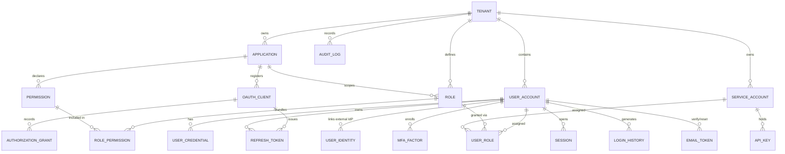
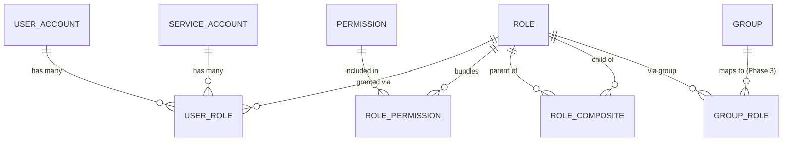

# 04 — Data Model

The schema targets **PostgreSQL** via JPA/Hibernate + Flyway, and is **Spring Authorization Server compatible**. Types stay mostly engine-neutral (via the conventions below) so the data layer can be ported to another engine later with limited churn, but Postgres features (`jsonb`, RLS) are used where they add real value.

## Conventions

| Concern | Decision | Why |
|---|---|---|
| Primary keys | **UUID v7**, `uuid` column, `@JdbcTypeCode(SqlTypes.UUID)` | Time-ordered, no sequence contention, non-guessable |
| Enums | `VARCHAR` + `@Enumerated(STRING)` | Avoid native DB enums (rigid, hard to migrate, non-portable) |
| JSON | `@JdbcTypeCode(SqlTypes.JSON)` → `jsonb` | Indexable, queryable metadata |
| Timestamps | UTC always; `timestamptz` | Prevent TZ drift |
| Booleans | `BOOLEAN` | Native in Postgres |
| Email | stored lowercased | Consistent uniqueness/lookups |
| Tenant isolation | `tenant_id` on every tenant-scoped table + **RLS** policies | DB-enforced backstop (see [Database Strategy](06-database.md)) |
| Migrations | Flyway, `db/migration/postgresql` | Versioned, repeatable |

## ERD

---

## Domain 1 — Tenancy & Applications

### `tenant`
| Column | Type | Notes |
|---|---|---|
| id | UUID | PK |
| slug | VARCHAR | unique |
| name | VARCHAR | |
| status | VARCHAR | `ACTIVE / SUSPENDED` |
| settings | JSON | tenant-level config |
| created_at, updated_at | TIMESTAMP | UTC |

### `application`
| id | UUID | PK |
| tenant_id | UUID | FK → tenant |
| name, slug, description | VARCHAR | unique `(tenant_id, slug)` |
| status | VARCHAR | |
| created_at | TIMESTAMP | |

### `oauth_client` (maps to Spring `RegisteredClient`)
| id | UUID | PK |
| application_id | UUID | FK |
| client_id | VARCHAR | unique |
| client_secret_hash | VARCHAR | hashed |
| client_name | VARCHAR | |
| redirect_uris, post_logout_uris, grant_types, scopes | JSON | |
| auth_method | VARCHAR | `client_secret_basic / none / private_key_jwt` |
| require_pkce | BOOLEAN | |
| access_token_ttl, refresh_token_ttl | INT (seconds) | |
| reuse_refresh_tokens | BOOLEAN | |

> Implemented via a **custom `RegisteredClientRepository`** so client config is tenant-aware and lives in our model.

---

## Domain 2 — Identity

### `user_account`
| id | UUID | PK |
| tenant_id | UUID | FK |
| email | VARCHAR | lowercased; unique `(tenant_id, email)` |
| email_verified | BOOLEAN | |
| username, phone | VARCHAR | optional |
| phone_verified | BOOLEAN | |
| display_name | VARCHAR | |
| status | VARCHAR | `ACTIVE / DISABLED / LOCKED / PENDING` |
| type | VARCHAR | `USER / ADMIN / SUPER_ADMIN` |
| failed_login_count | INT | brute-force tracking |
| locked_until | TIMESTAMP | |
| last_login_at | TIMESTAMP | |
| attributes | JSON | extensible profile |
| created_at, updated_at | TIMESTAMP | |

### `user_credential` (password history & rotation)
| id, user_id (FK) | UUID | |
| password_hash | VARCHAR | **Argon2id** |
| algorithm, params | VARCHAR/JSON | enables cost migration / rehash |
| is_current | BOOLEAN | |
| expires_at | TIMESTAMP | nullable; set from policy `expiryDays` at password set; `NULL` = never expires |
| expiry_warning_sent_at | TIMESTAMP | nullable; one approaching-expiry email per credential |
| expiry_expired_notice_sent_at | TIMESTAMP | nullable; one post-expiry reset email per credential |
| created_at | TIMESTAMP | |

See [Password expiry notifications](10-settings-governance.md#password-expiry-notifications) for runtime behavior.

### `user_identity` (federated logins)
| id, user_id (FK) | UUID | |
| provider | VARCHAR | `google / github / saml:acme` |
| provider_subject | VARCHAR | unique `(provider, provider_subject)` |
| metadata | JSON | |
| linked_at | TIMESTAMP | |

### `platform_admin` (super-admins, tenant-decoupled)
Separate table with its own credentials + MFA, so a tenant-scoped bug cannot escalate to platform control.
| id | UUID | PK |
| email | VARCHAR | unique |
| password_hash | VARCHAR | Argon2id |
| status | VARCHAR | |
| created_at | TIMESTAMP | |

---

## Domain 3 — Authorization (RBAC, app-scoped)

The model is **multi-role and many-to-many** end to end: a principal can hold many roles, each role bundles many permissions, and **composite roles** can include other roles (hierarchy). A principal's **effective permissions = the transitive union** of direct roles + composite (child) roles + group-derived roles (Phase 3).

> Editable source: [`diagrams/roles-permissions.drawio`](diagrams/roles-permissions.drawio)

### `permission`
| id, application_id (FK) | UUID | |
| key | VARCHAR | e.g. `invoice:read`; unique `(application_id, key)` |
| description | VARCHAR | |

### `role`
| id, tenant_id, application_id (FK) | UUID | |
| name | VARCHAR | unique `(application_id, name)` |
| description | VARCHAR | |
| is_default, is_system | BOOLEAN | |
| is_composite | BOOLEAN | true if it includes child roles |

### `role_permission` (join — role ↔ permission, many-to-many)
| role_id (FK), permission_id (FK) | UUID | PK `(role_id, permission_id)` |

### `role_composite` (self-referential — role hierarchy)
| parent_role_id (FK → role) | UUID | the composite role |
| child_role_id (FK → role) | UUID | role it includes |
| | | PK `(parent_role_id, child_role_id)` |

- A composite role **inherits all permissions of its child roles**, recursively (e.g. `super-editor` → `editor` + `reviewer`).
- **Cycle prevention**: insertion is rejected if it would create a loop (parent cannot be its own ancestor); resolution is depth-limited and memoized.
- Effective permissions are resolved at **token-issuance time** and cached; the `PolicyEvaluator` flattens the hierarchy.

### `user_role` (assignment / grant — principal ↔ role, many-to-many)
| id | UUID | PK |
| user_id (FK, nullable) | UUID | one of user/service |
| service_account_id (FK, nullable) | UUID | |
| role_id (FK) | UUID | |
| granted_by, granted_at | UUID/TIMESTAMP | |
| expires_at | TIMESTAMP | nullable (time-bound grant) |

> A principal may hold **multiple roles across multiple applications** simultaneously. Permission checks go through a **`PolicyEvaluator` interface** — flat + composite RBAC today, ABAC/ReBAC (OpenFGA) later with no caller changes. Group-based role mapping (`group_role`) arrives with organizations/groups in Phase 3.

---

## Domain 4 — Tokens, Sessions, Authorizations

### `session` (durable record; Redis is hot path)
| id, user_id (FK), tenant_id | UUID | |
| device, ip, user_agent | VARCHAR | |
| created_at, last_seen_at, expires_at, revoked_at | TIMESTAMP | |

### `authorization_grant`
Maps to Spring's `OAuth2Authorization` (JDBC `OAuth2AuthorizationService`), extended with `tenant_id` / `application_id` for admin views.

### `refresh_token`
| id | UUID | PK |
| client_id | VARCHAR | |
| user_id (nullable for M2M) | UUID | |
| token_hash | VARCHAR | store hash only |
| family_id | UUID | rotation/reuse-detection group |
| issued_at, expires_at, revoked_at | TIMESTAMP | |
| replaced_by | UUID | self-FK |

**Reuse detection:** presenting a revoked/rotated token in a family revokes the whole family.

---

## Domain 5 — MFA

MFA is a **graded, passkey-first** model (see [Auth Standards](05-auth-standards.md#mfa--2fa-graded-passkey-first)). The schema supports every factor option, while policy steers toward phishing-resistant ones.

### `mfa_factor`
| Column | Type | Notes |
|---|---|---|
| id, user_id (FK) | UUID | |
| type | VARCHAR | `PASSKEY / SECURITY_KEY / TOTP / PUSH / SMS / EMAIL / RECOVERY_CODE` |
| status | VARCHAR | `PENDING / ACTIVE / REVOKED` |
| aal | VARCHAR | assurance level reached: `AAL1 / AAL2 / AAL3` |
| label / device_name | VARCHAR | user-friendly name |
| secret_encrypted | BYTEA | TOTP seed / phone / email target — **KMS-encrypted** |
| phishing_resistant | BOOLEAN | true for PASSKEY / SECURITY_KEY |
| created_at, last_used_at | TIMESTAMP | |
| **WebAuthn fields** | | (PASSKEY / SECURITY_KEY) |
| credential_id | VARCHAR | base64url, unique |
| public_key | BYTEA | COSE key |
| aaguid | UUID | authenticator model (for attestation allow-lists) |
| sign_count | BIGINT | clone-detection counter |
| transports | JSON | `["internal","usb","nfc","ble"]` |
| attestation_fmt | VARCHAR | e.g. `packed`, `none` |
| backup_eligible / backup_state | BOOLEAN | synced-passkey signals |

Recovery codes stored **hashed**, one row each, marked `consumed_at` when used.

### `mfa_policy` (per tenant / org / role)
| Column | Type | Notes |
|---|---|---|
| id, tenant_id (FK) | UUID | |
| scope_type | VARCHAR | `TENANT / ORG / ROLE` |
| scope_id | UUID | nullable (tenant-wide) |
| required | BOOLEAN | MFA mandatory? |
| min_aal | VARCHAR | `AAL1 / AAL2 / AAL3` |
| allowed_factor_types | JSON | e.g. `["PASSKEY","SECURITY_KEY","TOTP"]` |
| phishing_resistant_only | BOOLEAN | reject TOTP/SMS/email |
| allow_synced_passkeys | BOOLEAN | device-bound vs cloud-synced |
| allowed_aaguids | JSON | hardware-key allow-list (nullable = any) |
| remembered_device_ttl | INT (seconds) | "trust this device" |
| reauth_interval | INT (seconds) | step-up re-auth cadence |
| created_at, updated_at | TIMESTAMP | |

### `trusted_device` (remembered devices for adaptive auth)
| id, user_id (FK), tenant_id | UUID | |
| device_fingerprint | VARCHAR | hashed |
| label, ip, user_agent | VARCHAR | |
| trusted_until | TIMESTAMP | |
| created_at, last_seen_at | TIMESTAMP | |

---

## Domain 6 — Machine-to-Machine

### `service_account`
| id, tenant_id, application_id (nullable) | UUID | |
| name, status | VARCHAR | |
| created_at | TIMESTAMP | |
Gets roles via `user_role` → same RBAC engine, no parallel system.

### `api_key`
| id, service_account_id (FK) | UUID | |
| key_prefix | VARCHAR | shown in UI |
| key_hash | VARCHAR | **hash only** |
| name | VARCHAR | |
| scopes | JSON | |
| expires_at, last_used_at, revoked_at | TIMESTAMP | |

API-key auth maps to OAuth2 **client-credentials** semantics internally for uniform downstream authz.

---

## Domain 7 — Audit & History

### `audit_log` (append-only — no UPDATE/DELETE)
| id, tenant_id | UUID | |
| actor_type | VARCHAR | `USER / ADMIN / SERVICE / SYSTEM` |
| actor_id | UUID | |
| action | VARCHAR | e.g. `user.login`, `role.assign` |
| target_type, target_id | VARCHAR/UUID | |
| ip, user_agent | VARCHAR | |
| metadata | JSON | |
| created_at | TIMESTAMP | |

Append-only enforced at the app layer (no update/delete repository methods); archive cold rows, stream to SIEM.

### `login_history`
| id, tenant_id, user_id | UUID | |
| result | VARCHAR | `SUCCESS / BAD_PASSWORD / MFA_FAILED / LOCKED` |
| ip, device | VARCHAR | |
| geo | JSON | |
| created_at | TIMESTAMP | |

### `email_token` (verification & reset)
| id, user_id (FK) | UUID | |
| type | VARCHAR | `VERIFY_EMAIL / RESET_PASSWORD` |
| token_hash | VARCHAR | hashed, single-use |
| expires_at, consumed_at | TIMESTAMP | short TTL |

---

## Domain 8 — Administration & Configuration

Backs the [Admin Control Plane](11-admin-control.md): admin scopes, layered settings, feature flags, and selectable auth methods. Settings resolve **Platform → Tenant → Org → App** with lockable overrides.

### `admin_scope` (catalog of admin capabilities)
| id | UUID | PK |
| key | VARCHAR | e.g. `users:write`, `mfa:reset`, `feature:toggle`; unique |
| description | VARCHAR | |

### `admin_role` (bundle of admin scopes)
| id, tenant_id (nullable for platform) | UUID | |
| name | VARCHAR | unique within boundary |
| boundary_type | VARCHAR | `PLATFORM / TENANT / ORG` |
| is_system | BOOLEAN | |

### `admin_role_scope` (join)
| admin_role_id (FK), admin_scope_id (FK) | UUID | PK pair |

### `admin_assignment` (who is an admin, and where)
| id | UUID | PK |
| principal_type | VARCHAR | `USER / PLATFORM_ADMIN` |
| principal_id | UUID | |
| admin_role_id (FK) | UUID | |
| boundary_type | VARCHAR | `PLATFORM / TENANT / ORG` |
| boundary_id | UUID | nullable for platform |
| granted_by, granted_at, expires_at | UUID/TIMESTAMP | |

### `setting` (layered key/value configuration)
| id | UUID | PK |
| scope_type | VARCHAR | `PLATFORM / TENANT / ORG / APP` |
| scope_id | UUID | nullable for platform |
| key | VARCHAR | e.g. `session.idle_timeout`, `password.min_length` |
| value | JSON | typed value |
| locked | BOOLEAN | if true, lower scopes cannot override |
| updated_by, updated_at | UUID/TIMESTAMP | |
| | | unique `(scope_type, scope_id, key)` |

### `feature_flag` (enable/disable capabilities per scope)
| id | UUID | PK |
| scope_type, scope_id | VARCHAR/UUID | as above |
| key | VARCHAR | e.g. `self_registration`, `social_login`, `saml`, `ldap`, `passwordless` |
| enabled | BOOLEAN | |
| locked | BOOLEAN | platform lock |
| plan_gated | BOOLEAN | availability tied to tenant plan |
| updated_by, updated_at | UUID/TIMESTAMP | |

### `auth_method_config` (selectable authentication methods)
| id, tenant_id (FK) | UUID | |
| scope_type, scope_id | VARCHAR/UUID | tenant or app |
| method | VARCHAR | `PASSWORD / PASSKEY / SOCIAL / SAML / LDAP / MAGIC_LINK / OTP` |
| enabled | BOOLEAN | |
| is_default | BOOLEAN | |
| display_order | INT | login-page ordering |
| config | JSON | method-specific (e.g. provider id) |

### `password_policy` (per tenant / org)
| id, tenant_id (FK) | UUID | |
| scope_type, scope_id | VARCHAR/UUID | |
| min_length, history_count | INT | |
| require_upper, require_number, require_symbol | BOOLEAN | |
| max_age_days | INT | nullable (no expiry) |
| breach_check | BOOLEAN | leaked-password detection |

> **Admin actions are audited** via `audit_log` (Domain 7). Sensitive actions (impersonation, disabling MFA enforcement, editing locked settings) require step-up; **self-lockout protection** and the **≥1 super-admin** invariant are enforced in the service layer.

---

## Indexing & key-design cheat-sheet

- `user_account`: unique `(tenant_id, lower(email))`; index `(tenant_id, status)`.
- `user_role`: index `(user_id)`, `(role_id)`, `(service_account_id)`.
- `role_composite`: PK `(parent_role_id, child_role_id)`; index `(child_role_id)` for reverse lookups.
- `refresh_token`: index `(token_hash)`, `(family_id)`, `(user_id)`.
- `audit_log` / `login_history`: composite `(tenant_id, created_at)`; consider monthly partitioning.
- `oauth_client`: unique `(client_id)`.
- `setting`: unique `(scope_type, scope_id, key)`; `feature_flag`: unique `(scope_type, scope_id, key)`.
- `admin_assignment`: index `(principal_type, principal_id)`, `(boundary_type, boundary_id)`.
- All tenant-scoped tables: lead composite indexes with `tenant_id`.
