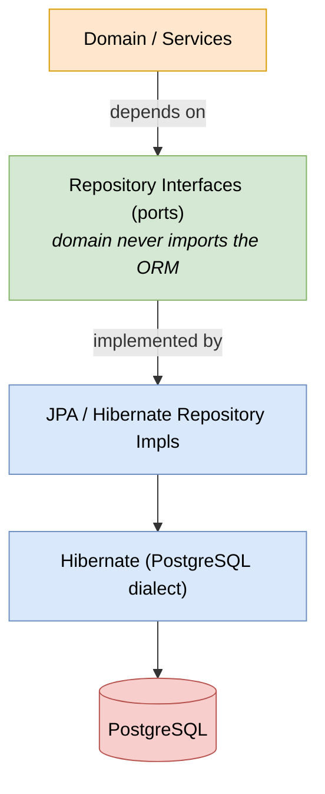
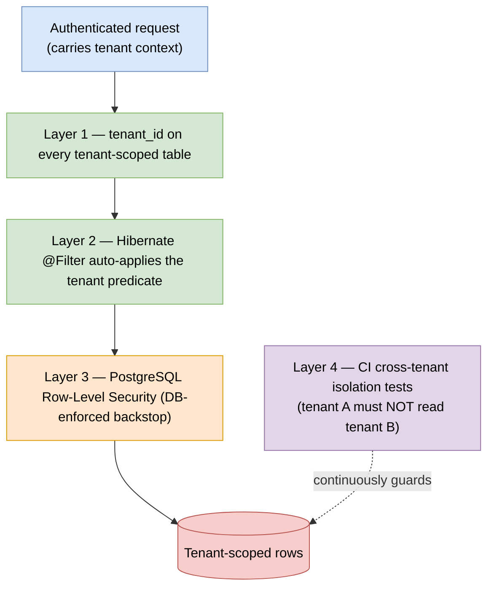

# 06 — Database Strategy

## Goal

Run on **PostgreSQL**, configured at install time, while keeping the data layer **abstracted behind repository interfaces** so a different engine could be added later without rewriting domain logic.

> **Current decision: PostgreSQL only.** We previously considered shipping PostgreSQL + MySQL together; that was dropped to reduce complexity (one dialect, one test matrix) and to let us use Postgres-native features like RLS and `jsonb`. The abstraction below keeps the door open without paying the multi-engine tax now.

## Why relational, why Postgres

IAM data is deeply relational: users, roles, permissions, grants, hierarchical tenants, referential integrity. NoSQL is a poor fit and is out of scope. PostgreSQL adds, on top of solid relational guarantees:

- **Row-Level Security (RLS)** — a database-enforced tenant-isolation backstop.
- **`jsonb`** — indexable flexible metadata.
- Strong concurrency (MVCC), rich indexing, mature tooling and managed offerings.

## Layering: ORM **and** Repository (complementary, not either/or)

> Editable source: [`diagrams/data-layer-layering.drawio`](diagrams/data-layer-layering.drawio)



> The **ports** layer is the swap point: adding a future engine means new adapters below this line, with the domain untouched.

- **ORM = JPA/Hibernate.** Maps `UUID`, `jsonb`, timestamps, etc. cleanly.
- **Repository pattern.** Domain logic depends on repository *interfaces*, not Hibernate — keeps the ORM/engine swappable and makes unit testing trivial (in-memory fakes). This is the abstraction that would let a future engine be added.
- **Adapter pattern — only for the leaks.** If a second engine is ever added, isolate the few genuinely engine-specific spots (RLS setup, JSON querying, advisory locks) behind adapters. Do **not** pre-abstract everything now.

> **Anti-pattern to avoid:** writing raw SQL everywhere "to stay engine-agnostic." That is how projects become accidentally engine-*specific* and lose Postgres's advantages anyway.

## Conventions (enforced)

| Concern | Rule |
|---|---|
| IDs | UUID v7, mapped via `@JdbcTypeCode(SqlTypes.UUID)` |
| Enums | `VARCHAR` + `@Enumerated(STRING)` (never native DB enum — keeps migrations and a future port easy) |
| JSON | `@JdbcTypeCode(SqlTypes.JSON)` → `jsonb` |
| Timestamps | UTC everywhere (`timestamptz`) |
| Booleans | `BOOLEAN` |
| Email/case | lowercased in app for consistent lookups/uniqueness |
| Tenant isolation | `tenant_id` everywhere + RLS (see below) |

See [Data Model](04-data-model.md) for the full schema applying these rules.

## Migrations — Flyway

```
db/migration/
└─ postgresql/
   ├─ V1__core_schema.sql
   ├─ V2__rbac.sql
   └─ V3__rls_policies.sql
```

- Versioned, repeatable migrations run automatically on app boot.
- Keep DDL Hibernate-portable where it costs nothing, so a future engine port is mostly RLS + a handful of functions.
- Liquibase (DB-agnostic XML/YAML) remains an alternative if multi-engine support is ever revived.

## Tenant isolation (defense in depth)

> Editable source: [`diagrams/tenant-isolation.drawio`](diagrams/tenant-isolation.drawio)



PostgreSQL lets us enforce isolation at multiple layers:

1. **Mandatory `tenant_id`** on every tenant-scoped table.
2. **Hibernate `@Filter`** auto-enabled per request from the authenticated tenant — queries cannot omit the predicate.
3. **PostgreSQL RLS** policies keyed on a per-connection setting (e.g. `SET app.tenant_id = ...`) — a database-enforced backstop even if application code has a bug.
4. **Automated cross-tenant isolation tests** in CI (the highest-value test suite here).

The tenant-resolution strategy is pluggable so enterprise tiers can later use **schema-per-tenant** or **database-per-tenant** without rewriting domain code.

## Connection management & scale

- Connection pooling (**HikariCP** in Spring; **PgBouncer** in front of Postgres at scale).
  - Note: with RLS using a per-connection `SET`, use session-level pooling (or set/reset within the transaction) so the tenant setting doesn't leak across pooled connections.
- **Read replicas** for read-heavy admin/audit queries.
- Cache hot, rarely-changing data (JWKS, discovery, tenant config) in **Redis**.

## Install-time configuration (how it works)

At install the operator sets the connection string (see [Installation](09-installation.md)):

```
SECUREONE_DB_URL=jdbc:postgresql://host:5432/secureone
SECUREONE_DB_USERNAME=...
SECUREONE_DB_PASSWORD=...
```

Hibernate uses the PostgreSQL dialect and Flyway applies the `postgresql` migrations automatically.
