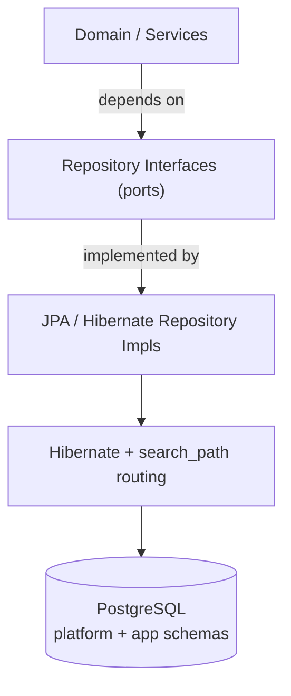

# 06 — Database Strategy

## Goal

Run on **PostgreSQL**, configured at install time, while keeping the data layer **abstracted behind repository interfaces** so a different engine could be added later without rewriting domain logic.

> **Current decision: PostgreSQL only.** See [ADR 0002](decisions/0002-database-postgresql.md).

## Physical layout (implemented)

```
secureone (database)
├── public
│   └── flyway_schema_history     ← Flyway only; never moved to platform
├── platform
│   ├── tenant, application, oauth_client, application_schema
│   ├── user_account, audit_log, platform_setting, …
│   └── legacy app IAM rows (schema_name IS NULL)
└── {app_slug}                    ← one schema per isolated application
    ├── role, permission, user_application, application_setting
    ├── rbac_group, rbac_group_role, rbac_group_member
    └── application_log
```

Migration **V45** moves shared tables from `public` → `platform` and introduces `oauth_client` + `application.schema_name`. Per-app DDL is applied at runtime from `db/migration/application-schema/V1__app_core.sql`.

Full guide: [15 — Applications & OAuth clients](15-applications-and-oauth-clients.md) · ADR: [0010](decisions/0010-platform-and-app-schemas.md).

## Why relational, why Postgres

IAM data is deeply relational. PostgreSQL adds:

- **Row-Level Security (RLS)** — tenant-isolation backstop (where enabled).
- **`jsonb`** — indexable flexible metadata.
- **Schemas** — isolate per-application IAM without separate databases.

## Layering: ORM **and** Repository

> Editable source: [`diagrams/data-layer-layering.drawio`](diagrams/data-layer-layering.drawio)



- **ORM = JPA/Hibernate** on PostgreSQL.
- **Repository pattern** — domain depends on interfaces, not Hibernate.
- **Schema routing** — `ApplicationSchemaJpaTransactionManager` sets `SET LOCAL search_path` at transaction begin from `ApplicationSchemaContext` (set by `ApplicationSchemaFilter` for app-scoped requests).

### Connection defaults

```dotenv
SECUREONE_DB_URL=jdbc:postgresql://localhost:5432/secureone?currentSchema=platform
```

- JDBC `currentSchema=platform` — default connection schema for platform tables.
- **`hibernate.default_schema` is not set** — app-scoped entities rely on `search_path` (`{app_schema}, platform`).

## Conventions (enforced)

| Concern | Rule |
|---|---|
| IDs | UUID, `@JdbcTypeCode(SqlTypes.UUID)` |
| Enums | `VARCHAR` + `@Enumerated(STRING)` |
| JSON | `@JdbcTypeCode(SqlTypes.JSON)` → `jsonb` |
| Timestamps | UTC (`timestamptz`) |
| Email | lowercased in app |
| Tenant isolation | `tenant_id` + RLS (where applied) |
| App IAM isolation | dedicated schema + `search_path` |

See [Data Model](04-data-model.md).

## Migrations — Flyway

```
apps/auth-server/src/main/resources/db/migration/
├── postgresql/                    ← platform migrations (V1…V45, R__z_repair_catalog.sql)
└── application-schema/
    └── V1__app_core.sql          ← template DDL (not Flyway-versioned per app)
```

- **Platform:** versioned scripts run on auth-server boot; history in **`public.flyway_schema_history`**.
- **Per-app:** `ApplicationSchemaProvisioner` runs `CREATE SCHEMA` + `V1__app_core.sql` inside the new schema; recorded in `platform.application_schema`.

```bash
cd apps/auth-server && ./gradlew flywayMigrate   # optional; bootRun also migrates
```

Full SQL reference: [18 — Flyway migration files](18-flyway-migration-files.md). Table & schema map: [17 — Database schemas & tables](17-database-schemas-and-tables.md).

### `flyway_schema_history`

Flyway’s bookkeeping table. Lists which SQL scripts have run (`version`, `description`, `success`). **Stays in `public`** — do not move it to `platform` (V45 excludes it).

## Tenant isolation (defense in depth)

> Editable source: [`diagrams/tenant-isolation.drawio`](diagrams/tenant-isolation.drawio)

1. **Mandatory `tenant_id`** on tenant-scoped tables.
2. **Hibernate `@Filter`** (where enabled) from authenticated tenant context.
3. **PostgreSQL RLS** (where policies exist) as a DB backstop.
4. **CI cross-tenant isolation tests** (target).

**Application isolation** adds schema-level separation for IAM tables (in addition to `application_id` predicates).

## Connection management & scale

- **HikariCP** in Spring; **PgBouncer** at scale.
- With RLS or `SET LOCAL search_path`, use session-level pooling or reset per transaction.
- Read replicas for admin/audit reads; Redis for sessions and cache.

## Install-time configuration

```dotenv
SECUREONE_DB_URL=jdbc:postgresql://host:5432/secureone?currentSchema=platform
SECUREONE_DB_USERNAME=secureone
SECUREONE_DB_PASSWORD=...
```

See [Installation](09-installation.md).
