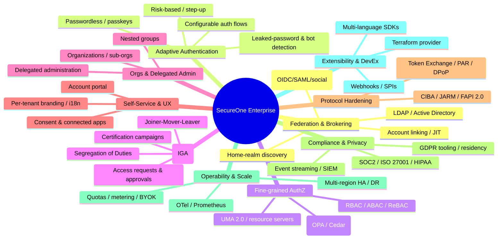

# 10 — Enterprise Capabilities

This document describes the capabilities that take SecureOne from a solid OIDC provider to a full **enterprise IAM platform** (Okta / Ping / ForgeRock / Entra ID / Keycloak-at-scale class).

> **Scope discipline:** none of this is in the MVP. Everything here is **clearly phased** (see [Roadmap](08-roadmap.md)) so the initial build stays lean. The existing foundation — isolated auth core, `PolicyEvaluator` abstraction, repository layer, append-only audit, pluggable tenant resolution — was designed so these are **additive**, not rewrites.

Capability map (Mermaid + editable source): [`diagrams/enterprise-capability-map.drawio`](diagrams/enterprise-capability-map.drawio)

---

## 1. Identity Federation & Brokering
- **Identity brokering** — federate inbound from many external IdPs at once (enterprise OIDC, SAML 2.0, social) with **home-realm discovery** (route by email domain).
- **LDAP / Active Directory user federation** — sync or on-demand, read/write, group→role mapping.
- **Account linking** + **just-in-time (JIT) provisioning** on first federated login.
- Standards: OIDC, SAML 2.0, LDAP, WS-Federation (legacy).

## 2. Advanced & Adaptive Authentication
- **Configurable authentication flows** — a flow/policy engine so each tenant composes its own login steps (password → conditional MFA → step-up).
- **Risk-based / adaptive auth** — device fingerprint, geo-velocity / impossible-travel, new-device, IP reputation → step-up or block.
- **Passwordless** — passkeys, magic links, OTP. See the full MFA model in [Auth Standards](05-auth-standards.md#mfa--2fa-graded-passkey-first).
- **Leaked-password detection** (k-anonymity) and **bot detection / CAPTCHA**.

## 3. Fine-grained Authorization (PDP / PEP)
- Centralized **Policy Decision Point** with **policy-as-code** (OPA/Rego or Cedar) beside RBAC/ABAC/**ReBAC (OpenFGA)**.
- **Resource server + scope/audience** registration; **UMA 2.0** for user-managed sharing.
- Externalized authz: apps ask "can subject X do action Y on resource Z?".

## 4. Identity Governance & Administration (IGA)
- **Joiner-Mover-Leaver (JML)** lifecycle automation.
- **Access requests + multi-step approval workflows** (manager / resource-owner).
- **Access certification / recertification campaigns**.
- **Segregation of Duties (SoD)** rules + entitlement management.
- **Time-bound / just-in-time access** grants (extends `user_role.expires_at`).

## 5. Organizations, Groups & Delegated Administration (B2B)
- **Organizations & sub-organizations**, **nested groups**, group-based role mapping.
- **Delegated administration** — org admins manage only their org via fine-grained admin scopes.
- Teams / membership with inherited permissions.

## 6. Self-Service & End-User Experience
- **Self-service account portal** — profile, security, active sessions, MFA devices, **consent & connected-apps management**, personal access tokens.
- **Per-tenant branding/theming** of login + emails, **i18n/localization**, custom domains.
- **Template management** (email/SMS) with versioning.

## 7. Enterprise Tokens & Protocol Hardening
- **Token Exchange (RFC 8693)**, **PAR (RFC 9126)**, **JARM**, **DPoP / mTLS-bound tokens**, **private_key_jwt** client auth, **back-channel logout**, **CIBA** (decoupled auth).
- **FAPI 2.0** profile for financial-grade / high-assurance clients.

## 8. Compliance, Privacy & Data Governance
- **Audit/event streaming** to Kafka/SIEM; immutable, tamper-evident logs.
- **GDPR/CCPA tooling** — consent records, data export, right-to-be-forgotten, data-residency/region pinning.
- Compliance posture targeting **SOC 2 / ISO 27001 / HIPAA**; configurable retention.

## 9. Operability & Scale (SRE)
- **Observability** — OpenTelemetry tracing, Prometheus metrics, health/readiness, admin dashboards.
- **Multi-region HA / active-active**, DR, automated backups, blue-green/canary deploys.
- **Per-tenant rate limits & quotas**, **usage metering / MAU** (SaaS billing).
- **HSM / BYOK** key management; automated signing-key rotation.

## 10. Platform Extensibility & DevEx
- **Webhooks / event hooks** + extension **SPIs** (custom authenticators, mappers, storage).
- **Terraform provider** (realms/clients/roles as IaC) + management API.
- **Multiple SDKs** (TS, Java, Python, Go) and framework adapters (Spring Security, Next.js, etc.).

---

## Data-model additions implied (future phases)
These are **not** in the MVP schema; noted so [Data Model](04-data-model.md) can grow predictably:

- `organization`, `group`, `group_role`, `group_membership` (orgs + nested groups)
- `identity_provider`, `idp_mapper` (federation/brokering config)
- `auth_flow`, `auth_flow_step` (configurable authentication flows)
- `access_request`, `approval`, `certification_campaign`, `certification_item`, `sod_rule` (IGA)
- `policy`, `resource_server`, `scope` (fine-grained authz / policy-as-code)
- `consent`, `connected_app` (self-service / consent management)
- `webhook`, `webhook_delivery`, `event` (extensibility + event streaming)
- `tenant_branding`, `email_template`, `sms_template` (theming / templates)
- `risk_signal`, `trusted_device` (adaptive auth)

See [Roadmap](08-roadmap.md) for sequencing.
