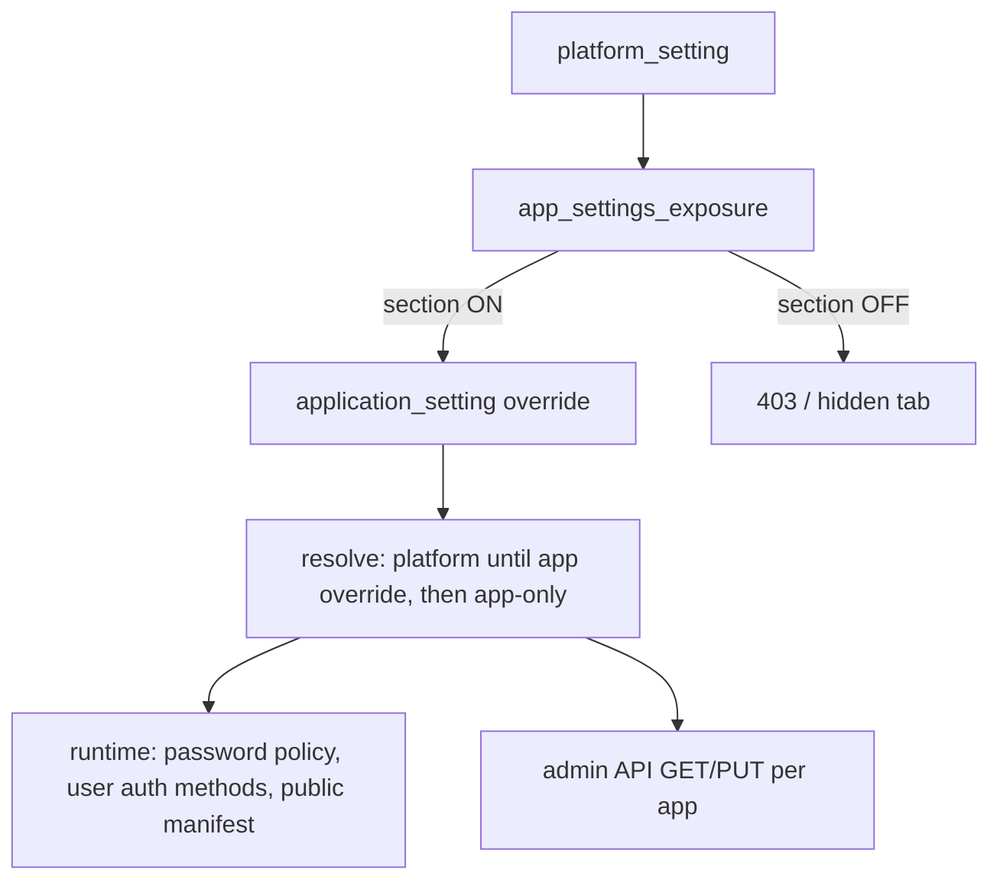
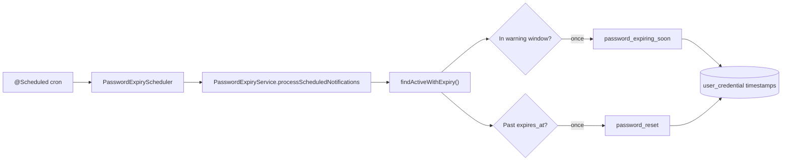

# Settings governance (platform → application)

SecureOne separates **platform policy** from **per-application overrides**. Application admins only see and edit sections the platform explicitly exposes.

## Flow



1. **Platform** (`/settings` or `/api/admin/v1/settings/*`) — super admin sets defaults and SMTP, auth catalog, flags, etc.
2. **For applications** — toggles which sections appear under each app’s **Settings** (`app_settings_exposure` / V10 migration).
3. **Application** (`/app/{id}/settings`) — only exposed sections. Each section has an explicit **Platform** vs **This application** control (`PUT .../settings/policy-source/{section}`). Platform mode shows tenant values read-only; application mode stores overrides in `application_setting`.
4. **Public API** (`GET /api/v1/applications/{id}`) — optional unauthenticated manifest; requires exposure **and** per-app `enabled`.

## Exposure section keys

| Exposure key | Application setting key | Admin tab |
|--------------|-------------------------|-----------|
| `notifications` | `notifications` | Notifications (alerts) |
| `email` | `email` | Notifications (sender) |
| `auth-methods` | `auth_methods` | Authentication, MFA |
| `password-policy` | `password_policy` | Password policy |
| `feature-flags` | `feature_flags` | Feature flags |
| `appearance` | `appearance` | Appearance (client app theme for public API; separate from platform admin console theme) |
| `user-directory` | `user_directory` | User directory |
| `public-manifest` | `public_manifest` | Public API |
| `token-policy` | `token_policy` | OAuth tokens (TTL, refresh rotation) — requires per-app `tabEnabled` |

### OAuth tokens (two-step enable)

1. **Platform → For applications → OAuth tokens tab** — allows apps to offer token management.
2. **Application → Settings → Feature flags** — toggle **OAuth tokens tab** (stored as `tabEnabled` on `token_policy`).
3. When both are on, the **OAuth tokens** tab appears and policy can be edited.

### MFA tab (two-step enable)

1. **Platform → For applications → Authentication & MFA** — allows apps to configure auth methods.
2. **Application → Settings → Authentication** — toggle **Enable MFA** (stored in `auth_mfa_tab`, API `/settings/mfa-tab/tab-enabled`).
3. When enabled, the **MFA** tab appears so factors (TOTP, passkey, etc.) can be configured.

### Feature flags catalog

The Feature flags tab (platform and application) lists only flags that **affect applications today**. OAuth grants, SAML, SCIM, and similar capabilities are configured elsewhere (auth methods, OAuth client config, exposure toggles) until wired to runtime checks.

**Active flags (4):**

| Key | Default | How it is used |
|-----|---------|----------------|
| `self_service_recovery` | ON | Blocks `POST /api/v1/applications/{id}/account/password/forgot` when OFF (`AccountNotificationService`). Magic link login uses the **auth method** `m_magic`, not this flag. |
| `self_registration` | OFF | Blocks public signup API when OFF (`ApplicationSignupService`). Also requires password auth method enabled + implemented. Public manifest `signup.enabled` mirrors this flag. |
| `ldap` | OFF | Blocks LDAP import API when OFF (`UserImportExportService`). Forces `sources.ldap.enabled = false` on user-directory save when OFF. Admin UI hides LDAP source/import when OFF. |
| `notification_email_test_ui` | ON | Shows or hides the SMTP test panel under **Application → Notifications** (admin UI only). |

Application effective flags = platform catalog merged with optional `application_setting.feature_flags` patches by `key`. **Platform is the master switch:** a flag is active for an application only when it is **ON at platform** and **ON for the application** (`effective = platform ∧ app`). Application admins cannot enable a flag while platform has it OFF; the toggle is disabled in the UI and saves are clamped server-side.

**Platform defaults** for active flags: `self_service_recovery` and `notification_email_test_ui` default **ON**; `self_registration` and `ldap` default **OFF** (opt-in at platform, then per app).

Capabilities removed from the flag catalog (OAuth grants, SAML, social login, passkeys, SCIM, etc.) are **not flag-gated** — they use auth methods, OAuth client config, and exposure toggles instead, and remain available when those settings allow them.

Setting exposure `feature-flags` controls whether app admins can edit overrides; runtime enforcement uses effective flags even when the tab is hidden.

**Removed from catalog** (were UI-only placeholders with no application impact):

| Key | Former category | Why removed |
|-----|-----------------|-------------|
| `oauth_authorization_code_pkce` | oauth | OAuth behavior not flag-gated; use OAuth client + token policy settings |
| `oauth_refresh_tokens` | oauth | Same |
| `oauth_client_credentials` | oauth | Same |
| `oauth_device_code` | oauth | Same |
| `oauth_token_introspection` | oauth | Same |
| `oauth_token_revocation` | oauth | Same |
| `oauth_pushed_authorization` | oauth | Same |
| `dpop` | oauth | Same |
| `adaptive_mfa` | identity | MFA/risk handled via auth methods and MFA tab, not this flag |
| `device_trust` | identity | Not implemented |
| `passwordless` | identity | Passkeys/passwordless via auth methods (`m_passkey`, etc.) |
| `social_login` | identity | Social/OIDC via auth methods |
| `saml` | identity | SAML via auth method `m_saml` |
| `scim_provisioning` | provisioning | Not implemented |

Migration `V41__trim_feature_flag_catalog.sql` strips removed keys from stored platform and application flag JSON.

`application.config` (OAuth client metadata) is separate from policy settings.

## Password policy resolution

Applications **inherit the platform password policy** until an application admin saves an override under **Application → Settings → Password policy**. After that:

- The application uses **only** its stored `application_setting.password_policy` snapshot.
- Platform changes no longer affect that application until the override is cleared (`DELETE .../settings/password-policy` or policy source reset to platform).

Runtime enforcement (set/reset/change password, signup, admin set password) uses the resolved policy for the active `applicationId`. Token flows resolve `applicationId` from the invite/reset context or user membership when possible; otherwise platform policy applies.

Enforced fields:

| Field | Enforced |
|-------|----------|
| `minLength`, complexity toggles | Yes — on every password set/change |
| `historyCount` | Yes — compared against recent credential hashes |
| `expiryDays` | Yes — stamped on credential at set time; login blocked when expired; see [Password expiry notifications](#password-expiry-notifications) |
| `hashAlgorithm` | Yes — stored on credential (`bcrypt` only today) |

## Password expiry notifications

When `expiryDays` is greater than zero, SecureOne enforces password lifetime end-to-end: credential stamping, proactive email warnings, automatic reset on expiry, and login blocking with a clear user message.

### Never expires (`expiryDays = 0`)

Setting **Password expiry (days)** to **0** means the password **never expires**:

- New credentials get `user_credential.expires_at = NULL`.
- No expiry warning or expired-reset emails are sent.
- Login is never blocked for password age.

This is the platform and application default when expiry is disabled.

### When expiry is enabled (`expiryDays > 0`)

1. **At password set** (signup, invite, reset, admin set password, change password) the active resolved policy’s `expiryDays` is stamped on the new current credential as `expires_at = now + expiryDays`.
2. **Before expiry** — a **warning email** is sent once per credential when the password enters the warning window (by default **7 days before** expiry, or fewer if `expiryDays` is less than 7).
3. **After expiry** — a **password reset email** is sent once per credential (same reset flow as forgot-password; no admin security alert for this automated path).
4. **On login** — if the current credential is expired, sign-in is **rejected**, the reset email is sent if not already sent for that credential, and the user sees a dedicated expired-password message.

Policy resolution follows the same rules as other password policy fields: platform until the application saves an override, then the application snapshot only.

### User-facing messages

| Surface | Behavior |
|---------|----------|
| Form login (`/login.html`) | Redirect to `?error=expired` with copy explaining the password expired and that a reset link was emailed |
| Session API login (`POST /api/v1/auth/session/login`) | `401` with message: *Your password has expired and you cannot sign in. A password reset link has been sent to your email address.* |
| Login history / diagnostics | Failure reason `password_expired` |

Users recover access by completing the emailed reset link (or using forgot-password). Token-based reset calls `setPassword`, which issues a new credential with a fresh `expires_at` from the resolved policy.

### Email templates

| Template key | When sent |
|--------------|-----------|
| `password_expiring_soon` | Credential is in the warning window and `expiry_warning_sent_at` is null |
| `password_reset` | Credential is past `expires_at` and `expiry_expired_notice_sent_at` is null (scheduled job or login attempt) |

Both use **application** SMTP and notification settings (`userEmailEnabled` must be on). If no application context can be resolved for the user, delivery is skipped and a warning is logged.

Template variable `{{expiryDate}}` is set on the warning email (UTC, medium date/time format).

### Scheduled job (`PasswordExpiryScheduler`)

Password expiry emails are driven by a **Spring `@Scheduled` background job** in the auth-server. Scheduling is enabled on `AuthServerApplication` (`@EnableScheduling`). The job bean is `PasswordExpiryScheduler`; it delegates to `PasswordExpiryService.processScheduledNotifications()`.



#### What each run does

1. Load all **current** credentials where `expires_at IS NOT NULL` (ordered by expiry).
2. Skip missing users and **suspended** accounts.
3. Resolve **application** context for SMTP (first linked app, or membership fallback).
4. For each credential at `now`:
   - **Expired** → send reset email if `expiry_expired_notice_sent_at` is null; set that timestamp.
   - **Not expired but in warning window** → send `password_expiring_soon` if `expiry_warning_sent_at` is null; set that timestamp.
5. Return the count of emails sent; log at **INFO** only when that count is greater than zero.

Failures for a single user (e.g. SMTP misconfiguration) are logged at **WARN** and do not stop the rest of the batch. Uncaught errors in the job are caught and logged at **WARN** so the scheduler keeps running on the next tick.

#### Configuration

Defined in `apps/auth-server/src/main/resources/application.yml`:

```yaml
secureone:
  password-expiry:
    scheduler-enabled: true          # SECUREONE_PASSWORD_EXPIRY_SCHEDULER
    check-cron: "0 0 */6 * * *"      # SECUREONE_PASSWORD_EXPIRY_CRON
```

| Setting | Env override | Default | Purpose |
|---------|--------------|---------|---------|
| `secureone.password-expiry.scheduler-enabled` | `SECUREONE_PASSWORD_EXPIRY_SCHEDULER` | `true` | When `false`, the `PasswordExpiryScheduler` bean is not registered (`@ConditionalOnProperty`) |
| `secureone.password-expiry.check-cron` | `SECUREONE_PASSWORD_EXPIRY_CRON` | `0 0 */6 * * *` | Spring **6-field** cron: `second minute hour day-of-month month day-of-week` |

**Default schedule:** at second `0`, minute `0`, every **6 hours** (`*/6` in the hour field) — i.e. 00:00, 06:00, 12:00, and 18:00 server time.

**Example cron values:**

| Expression | Meaning |
|------------|---------|
| `0 0 */6 * * *` | Every 6 hours (default) |
| `0 0 9 * * *` | Once daily at 09:00 |
| `0 0 8,17 * * MON-FRI` | 08:00 and 17:00 on weekdays |
| `0 */30 * * * *` | Every 30 minutes (useful in dev/testing only) |

There is **no admin UI** for the scheduler — only YAML or environment variables.

**Disable locally or in tests:**

```dotenv
SECUREONE_PASSWORD_EXPIRY_SCHEDULER=false
```

#### Scheduler vs login-triggered email

| Trigger | Warning email | Expired reset email |
|---------|---------------|---------------------|
| Scheduled job | Yes, when in warning window | Yes, when past `expires_at` |
| Expired login attempt | No | Yes, if not already sent for that credential |

So users who never log in still receive the approaching-expiry notice and the post-expiry reset from the job. Users who try to sign in after expiry get the reset immediately even if the job has not run yet.

#### Idempotency and multiple instances

Each credential stores `expiry_warning_sent_at` and `expiry_expired_notice_sent_at`. At most **one** warning and **one** expired-reset email are sent per password generation, regardless of how many times the job runs or which auth-server instance handles it. If several replicas run the same cron, duplicate sends are unlikely because the first successful save sets the timestamp; a second attempt sees it already set.

#### Logging

| Event | Level | Message pattern |
|-------|-------|-----------------|
| Job sent one or more emails | INFO | `Password expiry job sent N notification(s)` |
| Per-user send failure | WARN | `Failed to send password expiry warning…` / `Failed to send expired-password reset…` |
| Whole job failure | WARN | `Password expiry notification job failed: …` |

Search auth-server logs for `PasswordExpiryScheduler` or `PasswordExpiryService` when debugging missed notifications.

### Data model (`user_credential`)

| Column | Purpose |
|--------|---------|
| `expires_at` | Absolute expiry instant; `NULL` when policy had `expiryDays = 0` at set time |
| `expiry_warning_sent_at` | When the approaching-expiry email was sent (null = not yet sent) |
| `expiry_expired_notice_sent_at` | When the post-expiry reset email was sent (null = not yet sent) |

Migration: `V40__password_expiry_notifications.sql`.

### Implementation notes

- **Login enforcement:** `PasswordExpiryService.enforceLoginAllowed` (used by `TenantPasswordAuthenticationProvider` after password match).
- **Scheduled processing:** `PasswordExpiryScheduler` → `PasswordExpiryService.processScheduledNotifications` (see [Scheduled job](#scheduled-job-passwordexpiryscheduler) above).
- **Change password while logged in:** `PasswordPolicyService.assertNotExpired` still applies if a session somehow holds a credential that expired mid-session; normal expired users cannot sign in to reach that path.

## Enforcement status
|------|----------------|---------------------------|
| User directory import/export | Yes | Yes |
| User `allowedAuthMethods` | Yes | Yes (app-scoped admin) |
| Admin set password | Yes | Yes (app-scoped endpoint + policy) |
| Public manifest / signup hints | Yes | Yes |
| Password reset / invite (token flows) | N/A | Yes when `applicationId` can be resolved; else platform |
| Self-registration | N/A | Yes (application-scoped) |
| Login (`TenantPasswordAuthenticationProvider`) | N/A | Expiry check + reset email on expired login; auth method from platform |
| Platform notifications | N/A | Independent from application notifications |

Use `ApplicationEffectiveSettingsService` when wiring login and account flows to a `client_id` / application context.

## Appearance (two separate themes)

| Scope | Storage | Used by |
|-------|---------|---------|
| **Platform** | `platform_setting.appearance` | SecureOne **admin console** only (`ThemeProvider`, `/settings` → Appearance) |
| **Application** | `application_setting.appearance` | **Client apps** via public manifest when `sections.appearance` is enabled |

Application appearance includes branding (`appName`, `logoUrl`), the same color/gradient/toast controls as platform, plus widget colors (dialogs, inputs, dividers). It does **not** inherit the platform admin theme.

## Access control

| Who | Platform settings (`/settings`, `/api/admin/v1/settings/*`) | Application settings (`/app/{id}/settings`) |
|-----|---------------------------------------------------------------|---------------------------------------------|
| Platform operator (`admin` / `spring.security.user.name`) | View and edit | Via app console |
| Same account with `SECUREONE_ACT_AS_EMAIL` set | **Denied** (simulating a tenant user) | Allowed for granted apps |
| Tenant Admin, Member, app “Super Admin” role | **Denied** | Only exposed sections for their apps |

Tenant admins never see **Platform settings** in the sidebar. The `/settings` route returns 404 for them.

## Self-registration (application end users)

Integrated clients (e.g. an e-commerce app using SecureOne for identity) can let users create their own accounts when:

1. **Platform → For applications → Feature flags** is exposed for the app.
2. **Application → Settings → Feature flags** — enable **Self Registration** (`self_registration`).
3. **Authentication** — password method enabled and implemented (`m_password`).
4. **Public API** — manifest exposure on (optional; manifest includes a `signup` block with endpoints).

| Endpoint | Purpose |
|----------|---------|
| `GET /api/v1/applications/{id}/signup` | Whether sign-up is open, password policy hints, hosted page URL |
| `POST /api/v1/applications/{id}/signup` | Register (`email`, `password`, optional name fields) |

Hosted UI: `/account/signup.html?applicationId={id}` (links from `/login.html?applicationId={id}`). New users get app membership, the app’s default role (if configured), and a verification email. Sign in with tenant username `slug:email@domain.com`.

For hosted vs native/custom end-user UI (OAuth, magic link, session login, email link behavior), see [Authentication UI integration](13-auth-ui-integration.md).

**Until email is verified**, password sign-in is blocked. Application admins can open a user → **Security** → **Verify email (allow sign-in)** (or resend the verification link). API: `POST /api/admin/v1/applications/{applicationId}/users/{userId}/email/verify`.

## Operations

- After new migrations (V10+), restart **auth-server** (`./gradlew bootRun` in `apps/auth-server`).
- Dev login: `admin` / `admin` (no `SECUREONE_ACT_AS_EMAIL` for platform work); example app: `22222222-2222-2222-2222-222222222201`.
