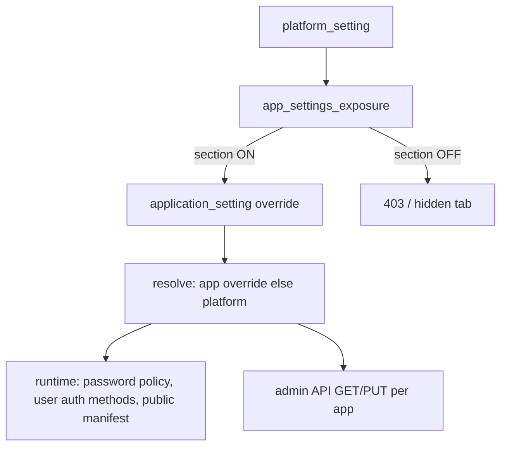

# Settings governance (platform → application)

SecureOne separates **platform policy** from **per-application overrides**. Application admins only see and edit sections the platform explicitly exposes.

## Flow

1. **Platform** (`/settings` or `/api/admin/v1/settings/*`) — super admin sets defaults and SMTP, auth catalog, flags, etc.
2. **For applications** — toggles which sections appear under each app’s **Settings** (`app_settings_exposure` / V10 migration).
3. **Application** (`/app/{id}/settings`) — only exposed sections. Each section has an explicit **Platform** vs **This application** control (`PUT .../settings/policy-source/{section}`). Platform mode shows tenant values read-only; application mode stores overrides in `application_setting`.
4. **Public API** (`GET /api/v1/applications/{id}`) — optional unauthenticated manifest; requires exposure **and** per-app `enabled`.

## Exposure section keys

| Exposure key | Application setting key | Admin tab |
|--------------|-------------------------|-----------|
| `notifications` | `notifications` | Notifications (alerts) |
| `email` | `email` | Notifications (sender) |
| `auth-methods` | `auth_methods` | Authentication, MFA |
| `password-policy` | `password_policy` | Password policy |
| `feature-flags` | `feature_flags` | Feature flags |
| `appearance` | `appearance` | Appearance (client app theme for public API; separate from platform admin console theme) |
| `user-directory` | `user_directory` | User directory |
| `public-manifest` | `public_manifest` | Public API |
| `token-policy` | `token_policy` | OAuth tokens (TTL, refresh rotation) — requires per-app `tabEnabled` |

### OAuth tokens (two-step enable)

1. **Platform → For applications → OAuth tokens tab** — allows apps to offer token management.
2. **Application → Settings → Feature flags** — toggle **OAuth tokens tab** (stored as `tabEnabled` on `token_policy`).
3. When both are on, the **OAuth tokens** tab appears and policy can be edited.

### MFA tab (two-step enable)

1. **Platform → For applications → Authentication & MFA** — allows apps to configure auth methods.
2. **Application → Settings → Authentication** — toggle **Enable MFA** (stored in `auth_mfa_tab`, API `/settings/mfa-tab/tab-enabled`).
3. When enabled, the **MFA** tab appears so factors (TOTP, passkey, etc.) can be configured.

`application.config` (OAuth client metadata) is separate from policy settings.

## Enforcement status

| Area | Admin UI gated | Runtime uses app resolve |
|------|----------------|---------------------------|
| User directory import/export | Yes | Yes |
| User `allowedAuthMethods` | Yes | Yes (app-scoped admin) |
| Admin set password | Yes | Yes (app-scoped endpoint + policy) |
| Public manifest | Yes | Yes |
| Password reset / invite (token flows) | N/A | Platform policy today |
| Login (`TenantPasswordAuthenticationProvider`) | N/A | Platform auth methods today |
| Email notifications content | Partial | Platform SMTP |

Use `ApplicationEffectiveSettingsService` when wiring login and account flows to a `client_id` / application context.

## Appearance (two separate themes)

| Scope | Storage | Used by |
|-------|---------|---------|
| **Platform** | `platform_setting.appearance` | SecureOne **admin console** only (`ThemeProvider`, `/settings` → Appearance) |
| **Application** | `application_setting.appearance` | **Client apps** via public manifest when `sections.appearance` is enabled |

Application appearance includes branding (`appName`, `logoUrl`), the same color/gradient/toast controls as platform, plus widget colors (dialogs, inputs, dividers). It does **not** inherit the platform admin theme.

## Access control

| Who | Platform settings (`/settings`, `/api/admin/v1/settings/*`) | Application settings (`/app/{id}/settings`) |
|-----|---------------------------------------------------------------|---------------------------------------------|
| Platform operator (`admin` / `spring.security.user.name`) | View and edit | Via app console |
| Same account with `SECUREONE_ACT_AS_EMAIL` set | **Denied** (simulating a tenant user) | Allowed for granted apps |
| Tenant Admin, Member, app “Super Admin” role | **Denied** | Only exposed sections for their apps |

Tenant admins never see **Platform settings** in the sidebar. The `/settings` route returns 404 for them.

## Operations

- After new migrations (V10+), restart **auth-server** (`./gradlew bootRun` in `apps/auth-server`).
- Dev login: `admin` / `admin` (no `SECUREONE_ACT_AS_EMAIL` for platform work); example app: `22222222-2222-2222-2222-222222222201`.
