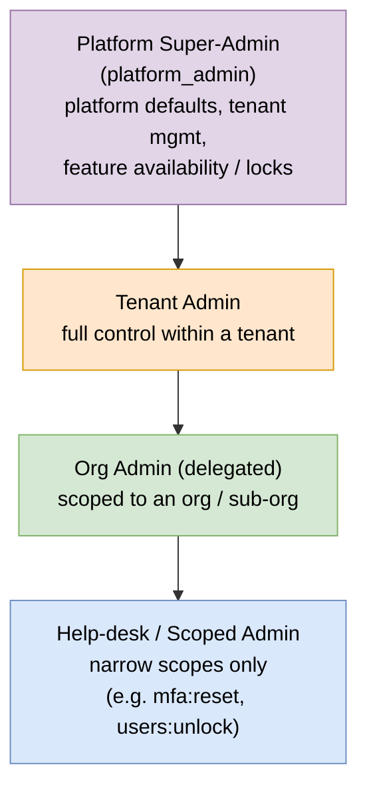
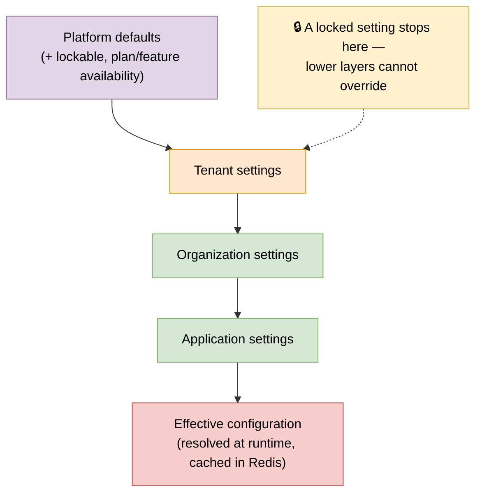

# 11 — Admin Control Plane

Admins get **full control** over their scope: enable/disable features, choose authentication methods, manage MFA (including reset), and exercise complete user lifecycle control — all governed by least-privilege admin scopes, layered configuration, and strong guardrails.

> Admin power is itself **RBAC**: admins hold *admin scopes*, so you grant exactly what each admin needs. Nothing here weakens the [Security](07-security.md) non-negotiables — every admin action is audited and sensitive ones require step-up.

---

## 1. Admin tiers & delegated administration



**Admin scopes (examples):** `users:read`, `users:write`, `users:delete`, `users:impersonate`, `mfa:reset`, `mfa:policy`, `sessions:revoke`, `roles:assign`, `settings:write`, `feature:toggle`, `auth-config:write`, `clients:write`, `audit:read`.

Admin roles bundle scopes and are assigned with a **scope boundary** (tenant or org), so a delegated admin can never act outside their boundary.

---

## 2. Layered configuration (inheritance, override & locks)

Settings resolve top-down; a lower layer overrides an upper one **unless the upper layer locks it**. This lets the platform *force* security (e.g. mandatory MFA) that tenants cannot disable.

> Editable source: [`diagrams/config-inheritance.drawio`](diagrams/config-inheritance.drawio)



### Setting groups admins control

| Group | Examples |
|---|---|
| **Feature toggles** | self-registration, social login, SAML, LDAP, passwordless, account linking, self-service portal, remember-device, password login on/off |
| **Authentication** | enabled methods + order (password, passkey/passwordless, social, SAML, LDAP, magic-link, OTP), default method, password policy, session/timeout rules |
| **MFA** | required?, min AAL, allowed factor types, phishing-resistant-only, AAGUID allow-list, grace period, remembered-device TTL, reauth interval, self-enroll permissions |
| **Tokens / security** | access/refresh TTLs, rotation, allowed grant types, redirect/CORS URIs per app |
| **Branding / notifications** | theme, email/SMS templates, locale/i18n |

---

## 3. Full user control

Admin actions available on a user (subject to scope + guardrails):

| Area | Actions |
|---|---|
| Lifecycle | create, edit profile/attributes, **enable / disable**, **lock / unlock**, soft-delete, force logout |
| Credentials | **reset password**, force change at next login, set temporary password |
| **MFA** | view enrolled factors, **reset / clear all MFA (force re-enrollment)**, revoke a specific factor, regenerate recovery codes, **MFA exemption (audited)**, require step-up |
| Verification | mark email/phone verified or unverified, resend verification |
| Roles & access | assign / revoke roles (time-bound), view effective permissions |
| Sessions & devices | view active sessions, **revoke one / all**, drop trusted devices |
| Identities | link / unlink external IdP identities |
| **Impersonation** | "log in as user" — time-boxed, consent/policy gated, heavily audited |
| Bulk | CSV import/export, bulk enable/disable/role-assign |

---

## 4. Guardrails (mandatory)

- **Audit everything** — every admin action writes to the append-only `audit_log` (actor, target, before/after, IP, reason). Impersonation sessions are tagged.
- **Step-up MFA / re-auth** for sensitive actions: impersonation, disabling MFA enforcement, deleting users, changing auth config, editing locked settings.
- **Self-lockout protection** — you cannot disable your own account, remove your own last admin role, or disable the auth method you're currently using. A tenant must always retain **≥ 1 active super-admin**.
- **Least privilege** — admin scopes + scope boundary; delegated admins confined to their org.
- **Platform locks** — platform can force-enable controls tenants cannot override.
- **Optional four-eyes / approval** on the most dangerous actions (ties into Phase 4 IGA in [Enterprise Capabilities](10-enterprise.md#4-identity-governance--administration-iga)).

---

## 5. Admin API surface (illustrative)

```
# Configuration & features
GET|PUT   /admin/tenants/{id}/settings
GET|PUT   /admin/tenants/{id}/features
PUT       /admin/tenants/{id}/auth-methods
GET|PUT   /admin/tenants/{id}/mfa-policy

# User control
POST      /admin/users/{id}/disable | enable | lock | unlock
POST      /admin/users/{id}/password/reset
POST      /admin/users/{id}/password/force-change
POST      /admin/users/{id}/mfa/reset
DELETE    /admin/users/{id}/mfa/factors/{factorId}
POST      /admin/users/{id}/recovery-codes/regenerate
POST      /admin/users/{id}/sessions/revoke
POST      /admin/users/{id}/roles
POST      /admin/users/{id}/impersonate        # step-up required, audited
```

All admin endpoints enforce the admin's scopes + boundary, and emit audit events.

---

## 6. Admin dashboard layout

- **Settings** → Features · Authentication · MFA · Security/Tokens · Branding · Notifications (with a "locked by platform" indicator).
- **Users** → list + detail tabs: Profile · Credentials · **MFA** · Roles · Sessions · Identities · Activity.
- **Admins & delegation** → admin roles, scopes, boundaries.
- **Audit log** → searchable, filter by actor/target/action.

See the data model in [Data Model § Domain 8](04-data-model.md#domain-8--administration--configuration) and sequencing in the [Roadmap](08-roadmap.md).
