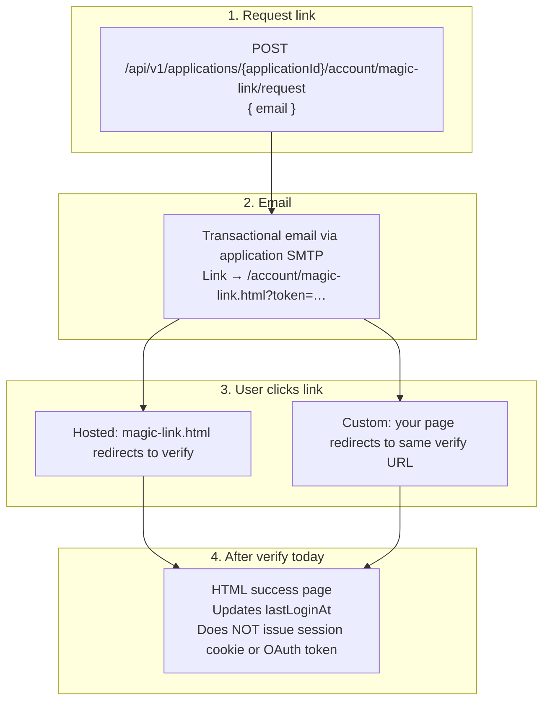

# 13 — Authentication UI integration

How end-user sign-in works when you use **SecureOne hosted pages**, the **admin integration console**, or your **application’s own UI**.

Related: [Auth standards](05-auth-standards.md), [API documentation](12-api-documentation.md), [Settings governance](10-settings-governance.md), [Installation — dev flows](09-installation.md#8-email--notifications-dev).

## Three surfaces

| Surface | What it is | Who uses it |
|---------|------------|-------------|
| **SecureOne hosted UI** | Static pages on the **auth-server** (default `http://localhost:9000`) — `login.html`, `magic-link.html`, `signup.html`, `forgot-password.html`, etc. | End users when you redirect to OAuth or link directly to hosted pages |
| **Admin console** (`admin-web`, default `:3001`) | Operator dashboard — tenants, users, **Application → Settings → Integration** | Platform and application **admins**, not your product’s end users |
| **Custom / native app UI** | Your SPA, mobile app, or storefront (e.g. Vite on `:5173`) | End users when you build your own login screens |

The **Authentication UI** preference under **Application → Settings → Integration** (`authUiMode`: `hosted` or `native`) is stored in `client_integration` and shown in the admin UI. It documents how your team intends to integrate; **your client app must implement the chosen mode**. The auth-server does not automatically switch UI based on this flag alone.

## Choosing a mode

| Mode | Best for | How users sign in |
|------|----------|-------------------|
| **Hosted SecureOne UI** (`authUiMode: hosted`) | Fastest integration, standard OIDC clients | Redirect to `/oauth2/authorize` → SecureOne renders login, MFA, and consent |
| **Native / custom UI** (`authUiMode: native`) | Branded experience, full control | Your forms call application-scoped account APIs; optional OAuth PKCE for tokens |

Both modes use the **same backend APIs**. The difference is who renders the HTML and where email links land (see [Native app URLs](#native-app-urls) below).

## Discovery

Integrated clients can load the public manifest (no auth required when public API exposure is enabled):

```http
GET /api/v1/applications/{applicationId}
```

The `account` block lists application-scoped endpoints (no `tenantSlug` required from the client):

| Field | Path |
|-------|------|
| `magicLinkRequestEndpoint` | `POST /api/v1/applications/{id}/account/magic-link/request` |
| `forgotPasswordEndpoint` | `POST /api/v1/applications/{id}/account/password/forgot` |
| `sessionLoginEndpoint` | `POST /api/v1/applications/{id}/auth/session/login` |
| `passwordResetEndpoint` | `POST /api/v1/account/password/reset` |
| `setPasswordEndpoint` | `POST /api/v1/account/set-password` |
| `loginUsernameFormat` | `tenantSlug:email` (e.g. `acme:user@example.com`) |

OIDC discovery applies to all modes:

```http
GET /.well-known/openid-configuration
```

## Hosted SecureOne UI

### OAuth login (primary path)

1. Your app redirects the browser to `/oauth2/authorize` with `client_id`, `redirect_uri`, PKCE `code_challenge`, etc.
2. Unauthenticated users land on **`/login.html`** on the auth-server.
3. After password (or future MFA) and consent, the user returns to your app with an authorization `code`.
4. Your backend or SPA exchanges the code at `/oauth2/token` for `access_token`, `id_token`, and optionally `refresh_token`.
5. Call `/userinfo` with the bearer token for claims.

Pass `applicationId` on hosted pages when you want app-scoped context in links:

```text
/login.html?applicationId={applicationId}
/account/signup.html?applicationId={applicationId}
/account/magic-link.html?applicationId={applicationId}
```

### Hosted account pages

| Page | Purpose |
|------|---------|
| `/login.html` | Password sign-in; links to magic link, signup, forgot password |
| `/account/magic-link.html` | Request magic link email |
| `/account/signup.html` | Self-registration (when enabled) |
| `/account/forgot-password.html` | Request password reset email |
| `/account/reset-password.html?token=…` | Complete password reset |
| `/account/set-password.html?token=…` | Set password from invite |

See [Installation — dev flows](09-installation.md#8-email--notifications-dev) for local URLs and MailHog testing.

## Native / custom app UI

When `authUiMode` is **native**, build your own screens and call the same APIs documented in **Application → Settings → Integration** (API catalog in admin-web).

### Session login (cookie-based)

```http
POST /api/v1/applications/{applicationId}/auth/session/login
Content-Type: application/json

{ "email": "user@example.com", "password": "…" }
```

On success, the auth-server sets a **session cookie** (`JSESSIONID`) on the auth-server origin. This works when your UI is same-origin with the auth-server or when you have configured cookies/CORS correctly for cross-origin use. For most SPAs, **OAuth Authorization Code + PKCE** is the recommended path instead.

### Password reset (custom landing pages)

Under **Native app URLs** in Integration settings, configure:

| Setting | Used for |
|---------|----------|
| `clientUrls.forgotPassword` | Your “forgot password” page (your UI calls the forgot API) |
| `clientUrls.passwordReset` | Base URL in reset emails; SecureOne appends `?token=…&applicationId=…` |

Password reset emails respect `clientUrls.passwordReset` when set; otherwise they use the hosted `/account/reset-password.html`.

### Magic link (custom UI)

**Request** (same as hosted):

```http
POST /api/v1/applications/{applicationId}/account/magic-link/request
Content-Type: application/json

{ "email": "user@example.com" }
```

Response is always a generic success message (anti-enumeration), whether or not the user exists.

**Email link (current behavior):** magic link emails always point to the **hosted** page:

```text
{SECUREONE_PUBLIC_BASE_URL}/account/magic-link.html?token=…
```

There is **no** `clientUrls.magicLink` override yet (unlike password reset). For a fully native magic-link landing page, you would need a future setting or have users complete verification on the hosted page and redirect back to your app.

**Verify:**

```http
GET /api/v1/account/magic-link/verify?token=…
```

Returns **HTML** (success or error page), not JSON. Hosted `magic-link.html` redirects here automatically. A custom page can read `?token=` from your URL and redirect to the same verify endpoint.

## Magic link flow (all UI types)



### Requirements

| Requirement | Notes |
|-------------|-------|
| Auth method **`m_magic`** enabled | Platform and application **Authentication** settings; method must be implemented |
| Application SMTP configured | **Application → Settings → Notifications** (not platform SMTP) |
| User exists in the application’s tenant | Email must match an existing user linked to that application context |
| Feature flag `self_service_recovery` | Controls **forgot password** only; **not** magic link |

### After magic link verify

Magic link verification **confirms identity** and updates login metadata but **does not**:

- Create an HTTP session (`JSESSIONID`), or
- Return OAuth access / refresh tokens.

To establish a full login session or token:

- **OAuth:** redirect to `/oauth2/authorize` (user may still need password on hosted login today), or
- **Session API:** `POST …/auth/session/login` if the user has a password, or
- **Future work:** wire magic-link completion into OAuth or session issuance.

## Comparison by flow

| Flow | Hosted UI | Custom UI | OAuth redirect |
|------|-----------|-----------|----------------|
| Password login | `/login.html` | Session API or your form → session API | `/oauth2/authorize` → `/login.html` |
| Magic link request | `/account/magic-link.html` | Your form → app-scoped API | N/A (separate path) |
| Magic link email destination | Auth-server hosted page | Same today | N/A |
| Magic link verify | Hosted redirect → verify URL | Your page → same verify URL | N/A |
| Get access token | Code exchange after OAuth | OAuth PKCE (recommended) or session cookie | Primary path |
| Forgot password | `/account/forgot-password.html` | Your page + forgot API | N/A |
| Reset password email link | Hosted or `clientUrls.passwordReset` | `clientUrls.passwordReset` | N/A |
| Self-registration | `/account/signup.html` | `POST …/signup` from your UI | N/A |

## Admin console vs end-user UI

Do not confuse:

- **`admin-web`** — manage tenants, applications, users, SMTP, auth methods, integration docs. Sign-in here uses platform or tenant **admin** credentials.
- **Auth-server hosted pages** — end-user login, signup, magic link, password reset for **integrated applications**.

Integration settings (OAuth client ID, application UUID, API catalog, `authUiMode`, native URLs) live in the admin console under **Application → Settings → Integration**. End users never need access to the admin console.

## Configuration reference

| Setting | Location | Effect |
|---------|----------|--------|
| `authUiMode` | Application → Integration | `hosted` or `native` (team preference; client must implement) |
| `clientUrls.forgotPassword` | Application → Integration (native) | Documentation / your forgot-password page URL |
| `clientUrls.passwordReset` | Application → Integration (native) | Reset email link base URL |
| `SECUREONE_PUBLIC_BASE_URL` | auth-server env | Base for all email links (default `http://localhost:9000`) |
| Public API exposure | Platform + application settings | Whether `GET /api/v1/applications/{id}` is available unauthenticated |
| Auth methods | Platform + application Authentication | Which methods (password, magic link, etc.) are enabled |
| Application SMTP | Application → Notifications | Required for magic link, reset, verification emails to end users |

## Known gaps (as of current implementation)

1. **Magic link email URL** — always hosted; no `clientUrls.magicLink` override.
2. **Magic link verify** — HTML only; no JSON API for SPA token handoff.
3. **Post-verify session** — verify does not create session or OAuth tokens; separate login step required.
4. **`login.html` magic link link** — default link omits `applicationId`; use `/account/magic-link.html?applicationId={id}` explicitly for app-scoped requests.

These are intentional documentation of current behavior; extend the platform if product requirements need fully native magic-link login with automatic token issuance.
