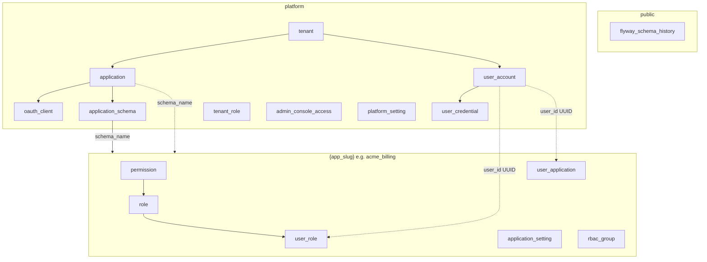
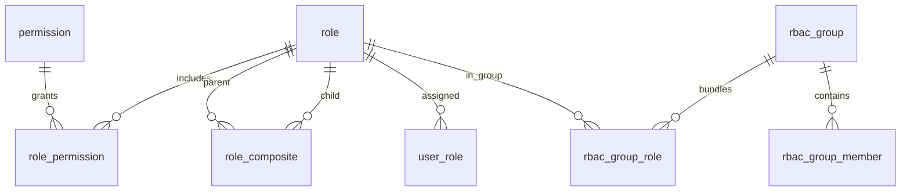
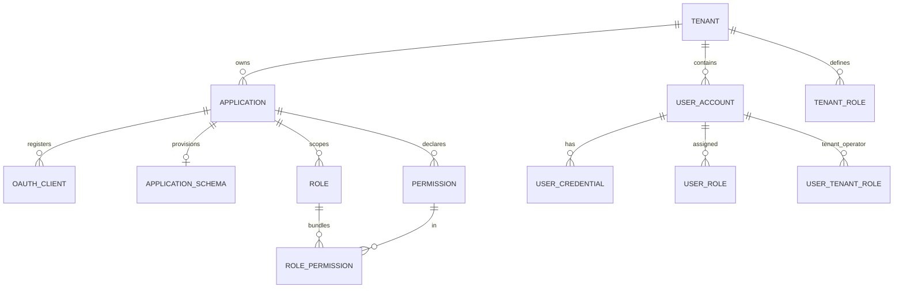

# 17 — Database Schemas & Tables

Reference for **PostgreSQL schemas**, **tables**, **foreign-key connections**, and **how the auth-server connects** at runtime.

Related: [04 — Data model](04-data-model.md) (column detail) · [06 — Database strategy](06-database.md) · [18 — Flyway migration files](18-flyway-migration-files.md) · [15 — Applications & OAuth clients](15-applications-and-oauth-clients.md)

---

## Connection

```dotenv
SECUREONE_DB_URL=jdbc:postgresql://localhost:5432/secureone?currentSchema=platform
SECUREONE_DB_USERNAME=secureone
SECUREONE_DB_PASSWORD=secureone
```

| Setting | Purpose |
|---------|---------|
| `currentSchema=platform` | JDBC default schema for platform tables |
| `hibernate.ddl-auto: none` | Schema owned by Flyway + app provisioner |
| No `hibernate.default_schema` | App-scoped queries use `search_path` instead |

**Runtime routing:** `ApplicationSchemaFilter` sets `ApplicationSchemaContext` → `ApplicationSchemaJpaTransactionManager` runs `SET LOCAL search_path TO {app_schema}, platform` at transaction start for application-console APIs.

---

## Schema layout

```
secureone (database)
├── public
│   └── flyway_schema_history          ← Flyway only (never in platform)
├── platform
│   ├── tenant, application, oauth_client, application_schema
│   ├── user_account, user_credential, email_token, mfa_factor
│   ├── tenant_rbac*, admin_console_*, platform_setting, audit_log, …
│   └── legacy app IAM (when application.schema_name IS NULL)
└── {app_slug}                       ← one schema per isolated application
    ├── permission, role, role_permission, role_composite, user_role
    ├── user_application, application_setting
    ├── rbac_group, rbac_group_role, rbac_group_member
    └── application_log
```



---

## Dual mode: legacy vs isolated application

| Mode | `application.schema_name` | IAM tables (`role`, `permission`, …) | OAuth clients |
|------|---------------------------|--------------------------------------|---------------|
| **Legacy** | `NULL` | In **`platform`** schema | `platform.oauth_client` |
| **Isolated** | e.g. `acme_billing` | In **`{app_slug}`** schema | `platform.oauth_client` (always platform) |

Identity (`user_account`, `tenant`) and OAuth registry stay in **`platform`**. Only application RBAC/settings/logs move to the app schema.

**Isolate:** `POST /api/admin/v1/applications/{id}/isolate` or admin UI → copies IAM to dedicated schema.

---

## `public` schema

| Table | Purpose | Connections |
|-------|---------|---------------|
| `flyway_schema_history` | Flyway migration log | Standalone (not FK-linked) |

---

## `platform` schema — tables & connections

### Tenancy & products

| Table | PK | Foreign keys / links |
|-------|-----|----------------------|
| `tenant` | `id` | — |
| `application` | `id` | `tenant_id` → `tenant.id` |
| `application_schema` | `application_id` | → `application.id`; `schema_name` → PG schema |
| `oauth_client` | `id` | `application_id` → `application.id` |

### Identity

| Table | PK | Foreign keys / links |
|-------|-----|----------------------|
| `user_account` | `id` | `tenant_id` → `tenant.id` |
| `user_credential` | `id` | `user_id` → `user_account.id` |
| `email_token` | `id` | `user_id` → `user_account.id` (nullable) |
| `mfa_factor` | `id` | `user_id` → `user_account.id` |

### Application RBAC (legacy — same names in app schema when isolated)

| Table | PK | Foreign keys / links |
|-------|-----|----------------------|
| `permission` | `id` | `application_id` → `application.id` |
| `role` | `id` | `tenant_id` → `tenant.id`; `application_id` → `application.id` |
| `role_permission` | `(role_id, permission_id)` | → `role.id`, `permission.id` |
| `role_composite` | `(parent_role_id, child_role_id)` | → `role.id` (self) |
| `user_role` | `id` | `user_id` → `user_account.id`; `role_id` → `role.id` |
| `user_application` | `(user_id, application_id)` | logical → `user_account`, `application` |
| `application_setting` | `(application_id, setting_key)` | `application_id` → `application.id` |
| `rbac_group` | `id` | `tenant_id`, `application_id` |
| `rbac_group_role` | `(group_id, role_id)` | → `rbac_group.id`, `role.id` |
| `rbac_group_member` | `(group_id, user_id)` | → `rbac_group.id`; `user_id` logical → `user_account` |
| `application_log` | `id` | `tenant_id`, `application_id` (nullable UUID refs) |

### Tenant console RBAC (platform operators)

| Table | PK | Foreign keys / links |
|-------|-----|----------------------|
| `tenant_permission` | `id` | `tenant_id` → `tenant.id` |
| `tenant_role` | `id` | `tenant_id` → `tenant.id` |
| `tenant_role_permission` | `(tenant_role_id, tenant_permission_id)` | → tenant RBAC tables |
| `tenant_role_application` | `(tenant_role_id, application_id)` | → `tenant_role`, `application` |
| `user_tenant_role` | `id` | `user_id` → `user_account.id`; `tenant_role_id` → `tenant_role.id` |
| `tenant_console_role_feature` | `(tenant_role_id, feature_key)` | → `tenant_role.id` |
| `tenant_user_roster` | `id` | `tenant_id` → `tenant.id`; roster metadata |

### Admin console access

| Table | PK | Foreign keys / links |
|-------|-----|----------------------|
| `admin_console_access` | `id` | `user_id` → `user_account.id`; tenant/app scope columns |
| `admin_console_feature_override` | `id` | operator feature overrides |

### Platform config & audit

| Table | PK | Foreign keys / links |
|-------|-----|----------------------|
| `platform_setting` | `key` | JSON blobs: SMTP, auth methods, password policy, … |
| `audit_log` | `id` | `tenant_id` optional |
| `login_history` | `id` | `tenant_id`, `user_id` optional |

---

## Per-application schema (`{app_slug}`) — tables & connections

Created by `ApplicationSchemaProvisioner` from `application-schema/V1__app_core.sql`. Cross-schema references use **UUID columns** (no FK to `platform.user_account` — enforced in application layer).

| Table | PK | In-schema FKs | Platform refs (logical) |
|-------|-----|---------------|-------------------------|
| `permission` | `id` | — | `application_id` |
| `role` | `id` | — | `tenant_id`, `application_id` |
| `role_permission` | composite | `role_id`, `permission_id` | — |
| `role_composite` | composite | parent/child `role_id` | — |
| `user_role` | `id` | `role_id` → `role` | `user_id`, `granted_by` |
| `user_application` | composite | — | `user_id`, `application_id` |
| `application_setting` | composite | — | `application_id` |
| `rbac_group` | `id` | — | `tenant_id`, `application_id` |
| `rbac_group_role` | composite | `group_id`, `role_id` | — |
| `rbac_group_member` | composite | `group_id` | `user_id` |
| `application_log` | `id` | — | `tenant_id`, `application_id` |



---

## Entity relationship (platform core)



> Full column lists: [04 — Data model](04-data-model.md). Editable diagrams: [Diagrams](diagrams/README.md) → data-layer-layering, tenant-isolation, roles-permissions.

---

## Useful inspection queries

```sql
-- Schemas
SELECT schema_name FROM information_schema.schemata
WHERE schema_name NOT IN ('pg_catalog', 'information_schema')
ORDER BY 1;

-- Applications and dedicated schemas
SELECT id, name, slug, schema_name FROM platform.application ORDER BY name;

-- Flyway history
SELECT installed_rank, version, description, success, installed_on
FROM public.flyway_schema_history ORDER BY installed_rank;

-- Tables in platform vs an app schema
SELECT tablename FROM pg_tables WHERE schemaname = 'platform' ORDER BY 1;
SELECT tablename FROM pg_tables WHERE schemaname = 'your_app_slug' ORDER BY 1;

-- OAuth clients per application
SELECT a.name, oc.client_id, oc.type, oc.status
FROM platform.oauth_client oc
JOIN platform.application a ON a.id = oc.application_id;
```

---

## Related documents

| Topic | Document |
|-------|----------|
| Column-level ERD | [04 — Data model](04-data-model.md) |
| Flyway & isolation strategy | [06 — Database strategy](06-database.md) |
| Full migration SQL | [18 — Flyway migration files](18-flyway-migration-files.md) |
| App create / isolate | [15 — Applications & OAuth clients](15-applications-and-oauth-clients.md) |
| ADR platform + app schemas | [decisions/0010](decisions/0010-platform-and-app-schemas.md) |
